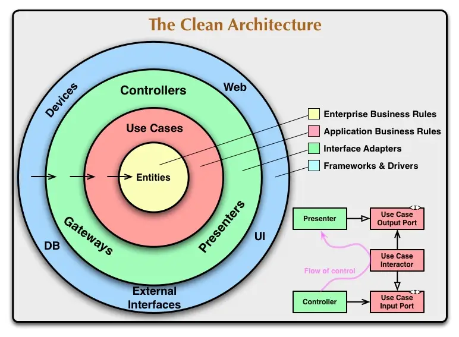

Este é um texto introdutório sobre Clean Architecture, com o objetivo de apresentar seus conceitos principais de forma clara, objetiva e progressiva. A intenção não é propor uma estrutura de pastas ou um modelo fechado, mas explicar a regra de dependência, as camadas conceituais e o papel de cada componente dentro dessa abordagem arquitetural.

## Contexto

Em sistemas complexos, começam a surgir dificuldades para testar o código e, com o tempo, pode haver a necessidade de mudar ferramentas e tecnologias sem alterar a regra de negócio. Em muitos casos, essas mudanças exigem prazos longos ou até a reescrita de grandes partes do sistema.

Para lidar com esse problema, Uncle Bob (Robert C. Martin) propôs o conceito arquitetural chamado Clean Architecture: uma forma de organizar sistemas de maneira concêntrica, separando claramente a regra de negócio (domínio) dos detalhes de implementação, como frameworks, banco de dados, UI, bibliotecas, entre outros.

O objetivo principal é ter um domínio blindado e independente, sem acoplamento direto a qualquer framework ou tecnologia específica.

> Segundo Uncle Bob, uma boa arquitetura é aquela que permite adiar decisões de implementação.

Ou seja, existe a possibilidade de esperar mais tempo antes de decidir qual framework, qual banco de dados ou qual mecanismo técnico será utilizado, reduzindo o custo de mudanças ao longo da vida do sistema.

## Conceitos principais da Clean Architecture

### Dependency Rule (Regra de Dependência)

A Dependency Rule é o conceito fundamental da Clean Architecture.
Ela estabelece que as dependências de código sempre devem apontar para dentro.
O sistema é composto por níveis:

- **Parte mais interna:** Entidades
- **Parte intermediária:** Casos de uso e mecanismos da aplicação
- **Parte mais externa:** Softwares e detalhes técnicos (frameworks, banco, UI)

Seguindo essa regra, as camadas internas não conhecem as camadas externas.

> Atenção: O modelo clássico da Clean Architecture apresenta quatro camadas conceituais, mas não há uma limitação rígida.
> Caso seja necessário, novas camadas ou subdivisões podem ser criadas, desde que a Dependency Rule continue sendo respeitada.

### Camadas do Clean Architecture

Podemos visualizar o conceito da Clean Architecture de forma ilustrativa no diagrama “The Clean Architecture”, representado como um conjunto de círculos concêntricos com quatro camadas principais.

#### Entidades (Entities)

As Entities  ou também chamados de Domínios no DDD, eles encapsulam as regras de negócio mais importantes e estáveis do sistema. Tem como características de serem um objeto com métodos e comportamentos, podem ser utilizadas em diferentes contextos da aplicação e não devem ser afetadas por camadas externas, abstraindo os frameworks, bancos de dados ou IA, sendo o nível mais alto de abstração do domínio.

#### Interface Adapter

A camada de Interface Adapters é responsável por converter dados externos para o formato esperado pelos Use Cases e Entidades, e também por realizar o caminho inverso, adaptando os dados internos para o formato exigido pelo mundo externo.

Essa camada atua como uma fronteira de proteção, impedindo que detalhes de apresentação, transporte ou persistência vazem para o núcleo da aplicação.

#### Frameworks and Drivers

A camada de Frameworks and Drivers contém os detalhes técnicos da aplicação composta por frameworks, banco de dados, ORM, bibliotecas externas etc.
Essa é a camada responsável por conectar a aplicação ao mundo externo, implementando as interfaces definidas nas camadas internas.
Sendo  volátil e substituível e depende do núcleo da aplicação, nunca o contrário.

#### Use Cases

Os Use Cases representam as intenções da aplicação, no qual orquestram a execução das regras de negócio, decidem quando aplicar uma ação, em qual ordem e com quais dependências.
Os Use Cases dependem das entidades, mas as entidades não dependem dos Use Cases.
Uma pergunta bem comum é:

> "Então por que Use Cases existem se entidades já são alto nível?"

A resposta é segregação de responsabilidade, onde as Entidades são genéricas e reutilizáveis, já Use Case são específicos da aplicação.
Uma mesma entidade pode ser utilizada por vários Use Cases diferentes, cada um com regras de orquestração distintas.
Vale lembrar que nem toda regra de negócio vive exclusivamente nas entidades. Algumas regras de política da aplicação pertencem aos Use Cases.
Tudo isso de forma independente de contratos externos, como HTTP ou banco de dados.
O Use Case não se comunica com camadas externas, interagindo apenas com **interfaces**, que são implementadas fora do núcleo.

#### Crossing Boundaries

Crossing Boundaries são as fronteiras explícitas onde controle, dados e dependências atravessam limites arquiteturais entre as políticas de alto nível ou detalhes de baixo nível.
Reduzindo o impacto de mudanças, melhorando a testabilidade e evitando o vazamento de detalhes técnicos.
Essas fronteiras exigem o uso da **Inversão de Dependência (DIP)** para garantir que o núcleo do sistema permaneça independente de implementações externas.

## Vantagens e desvantagens da Clean Architecture

### Vantagens

- Protege o domínio e a regra de negócio
- Facilita testes (especialmente testes de regras e casos de uso)
- Promove baixo acoplamento
- Permite abstrair frameworks e banco de dados

### Desvantagens

- Maior complexidade inicial
- Curva de aprendizado mais alta
- Mais indicada para sistemas grandes ou que sofrem mudanças frequentes

## Arquitetura não é estrutura de pastas

Precisamos deixar claro que Clean Architecture **não trata de como organizar pastas ou arquivos**, nem do nome dessas pastas.
A estrutura física do projeto não define a arquitetura.

O que define a arquitetura são:

- as regras de dependência
- os limites entre responsabilidades
- quem depende de quem

Pastas são apenas uma consequência dessas decisões.

## Conclusão

A Clean Architecture existe para proteger o domínio, manter o sistema flexível, testável e evolutivo, mesmo diante de mudanças tecnológicas.

Ela não é sobre pastas, frameworks ou modismos, mas sobre controle de dependências, fronteiras bem definidas e longevidade do software.
Não é uma abordagem adequada para qualquer projeto ou equipe. É necessário avaliar:

* o nível técnico do time
* a complexidade do domínio
* a probabilidade de mudanças frequentes nos requisitos

# Referências

- Martin, Robert C. *Clean Architecture: A Craftsman’s Guide to Software Structure and Design*. Prentice Hall, 2017.
- https://dev.to/bosepchuk/why-i-cant-recommend-clean-architecture-by-robert-c-martin-ofd
- https://blog.cleancoder.com/uncle-bob/2012/08/13/the-clean-architecture.html
 
