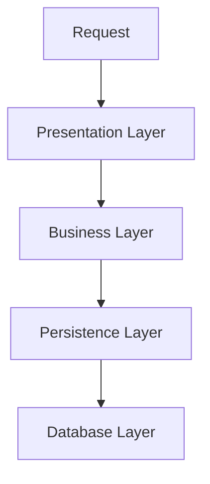
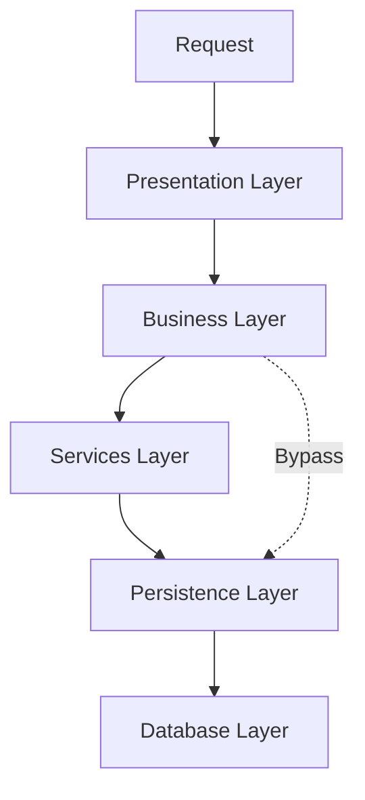
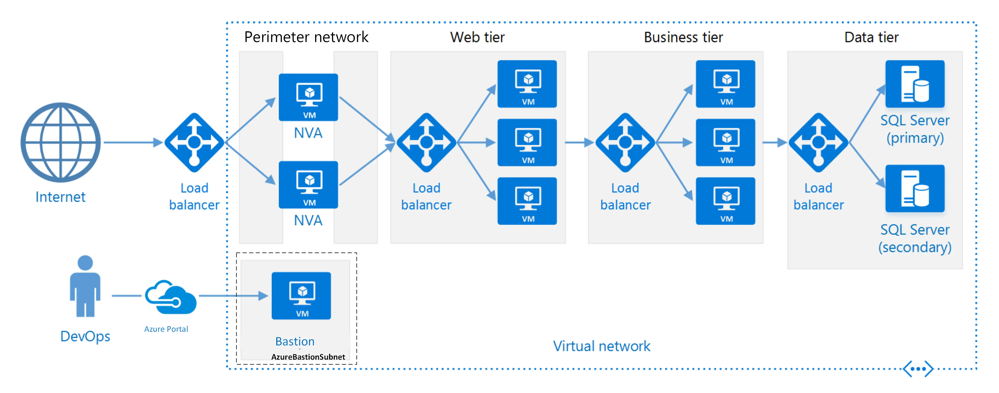
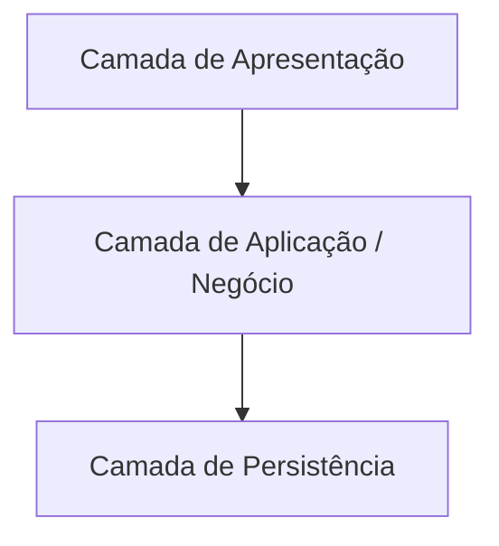

A arquitetura em camadas é um estilo arquitetural cujo princípio central é organizar sistemas em níveis hierárquicos, separando responsabilidades para reduzir a complexidade. Para compreender como essa ideia surgiu, é importante voltar um pouco à história.

Não há um ‘marco único’ aceito como origem do termo afirmando que “aqui surgiu a arquitetura em camadas”. Ela se consolidou na prática corporativa, nos anos 1980 e 1990, com os avanços dos sistemas _client-server_ e da web, dando origem aos modelos _three-tier architecture_ e, posteriormente, a *N-tier*. No entanto, houve dois artigos conceituais escritos anteriormente.

Em 1968, Dijkstra escreveu o artigo **“THE STRUCTURE OF THE 'THE'-MULTIPROGRAMMING SYSTEM”**, que descrevia um sistema de multiprogramação para _mainframes_ capaz de rodar aplicações matemáticas complexas. Na época, era muito difícil testar e entender o comportamento de programas concorrentes. Então ele propôs uma forma estrutural e hierárquica de organizar o sistema, a fim de controlar a concorrência, isolar responsabilidades e facilitar o raciocínio e os testes. O foco dele não era a camada de aplicação, como conhecemos hoje, mas sim a camada de execução dos sistemas operacionais. Essa foi uma das primeiras demonstrações formais de que dividir um sistema em camadas hierárquicas melhora a previsibilidade e o controle de complexidade, o conceito que se tornaria fundamental na engenharia de software.

Em 1972, Parnas escreveu o artigo **“On the Criteria To Be Used in Decomposing Systems into Modules”**. Parnas observou que os sistemas estavam ficando cada vez maiores e mais complexos, pois seguiam basicamente o modelo Entrada → Processamento → Saída. Esse tipo de estrutura era frágil, qualquer mudança em uma etapa quebrava várias partes do sistema, dificultava o reuso e os testes.
Então ele propôs expor apenas o que fosse necessário, sem permitir que os outros módulos conhecessem os detalhes internos. Isso trouxe flexibilidade, melhor compreensibilidade, controle de impacto (já que apenas o módulo específico precisaria ser alterado) e possibilitou o paralelismo no desenvolvimento (mais de um programador poderia trabalhar ao mesmo tempo no código sem interferir entre si).

No artigo, Parnas cita Dijkstra. Enquanto Dijkstra organizava o sistema para provar o funcionamento, Parnas organizava o sistema para facilitar a manutenção e a evolução. Apesar das diferenças, ambos compartilhavam as mesmas ideias base: dividir os sistemas em partes hierárquicas, cada parte com responsabilidades claras, limitar a dependência entre módulos e favorecer o raciocínio isolado de cada módulo.

Com o crescimento da indústria de software nas décadas seguintes, essas noções de modularidade e hierarquia passaram a ser aplicadas de forma empírica em sistemas corporativos cada vez mais complexos.

Nos anos 1980-1990, com os avanços dos sistemas _client-server_, tornou-se comum adotar divisões lógicas entre apresentação, lógica de negócio e dados. Esse modelo foi chamado de _three-tier architecture_ ou _N-tier_ (quando havia mais níveis).   
O termo **layered architecture** apareceu de forma mais sistematizada em obras como:

* **Mary Shaw e David Garlan**, no livro _Software Architecture: Perspectives on an Emerging Discipline_ (1996),
- **Martin Fowler (2002)**, no livro _Patterns of Enterprise Application Architecture_, que popularizou o termo com foco em sistemas corporativos:

No livro de Martin Fowler, ele comenta como um estilo flexível, que pode ser adaptado conforme o contexto do sistema e apresenta os benefícios de quebrar os sistemas em camadas
- Você pode entender uma camada de forma independente, sem precisar conhecer os detalhes das outras.
- É possível substituir uma camada por outra implementação equivalente (ex.: trocar a tecnologia de rede sem alterar o serviço).
- As camadas reduzem dependências: mudanças em uma não obrigam mudanças em todas.
- As camadas são bons pontos para padronização (como TCP e IP, que definem como devem funcionar).
- Uma camada já construída pode ser reutilizada por vários serviços de nível mais alto (ex.: TCP/IP serve de base para FTP, SSH, HTTP etc.).

Existem alguns desafios:
*  As camadas encapsulam algumas coisas, mas não todas, de forma eficaz, o que traz uma mudança em cascata, se você precisa adicionar um novo campo para o usuário, você precisa adicionar em todas as camadas até chegar no banco de dados
* As camadas extras podem prejudicar o desempenho, cada transformação de uma representação para outro pode gerar uma lentidão no sistema, porém uma encapsular funções podem trazer ganho de eficiência que pode se beneficiar.

O mais difícil na arquitetura de camadas é decidir qual camada deve ter e quais responsabilidades de cada camada deve possuir.

Martin, ele fala que existe 3 principais camadas, podendo existir mais

* Camada de apresentação (Presentation Layer): Responsável pela interação entre o usuário e o sistema, ou seja, receber as informações e devolver para o cliente.
* Camada de dados de origem (Data Source Layer): Responsável pela comunicação entre o sistema e fontes externas de dados (como bancos de dados, APIs ou outros sistemas).
* Camada de lógica de domínio (Domain Logic Layer):  Responsável pela lógica de negócio da aplicação, ou seja, as regras que realmente fazem o sistema ter valor.

## Arquitetura em Camadas e o modelo N-Tier

A arquitetura N-Tier, também conhecida como arquitetura multicamada, é uma generalização da _three-tier architecture_, permitindo a divisão do sistema em um número maior de camadas conforme a complexidade e as necessidades do domínio. Esse modelo é amplamente utilizado em sistemas corporativos por facilitar a separação de responsabilidades e a distribuição física da aplicação.

Em uma arquitetura N-Tier, as camadas podem ser organizadas como camadas fechadas (closed layers) ou camadas abertas (open layers), dependendo das regras de dependência adotadas.

Em uma arquitetura de camadas fechadas, cada camada só pode se comunicar com a camada imediatamente inferior. Essa restrição reduz o acoplamento, melhora a previsibilidade do sistema e facilita a manutenção, pois todas as interações seguem um fluxo bem definido.

Exemplo de arquitetura com camadas fechadas

Já em uma arquitetura de camadas abertas, determinadas camadas permitem acessos diretos a camadas inferiores, ignorando intermediárias. Esse *bypass* pode ser utilizado de forma controlada em cenários específicos, como otimizações de desempenho ou fluxos simples que não se beneficiam da lógica intermediária.

Exemplo de arquitetura com camada aberta

Embora camadas abertas não sejam um erro por definição, seu uso excessivo pode levar ao Architecture Sinkhole Anti-Pattern, no qual múltiplas camadas apenas repassam chamadas sem adicionar comportamento ou valor real ao fluxo. Nesses casos, a arquitetura se torna mais complexa sem entregar benefícios proporcionais.  

Uma diretriz prática frequentemente citada é a regra 80/20: se cerca de 80% dos fluxos passam pelas camadas intermediárias agregando valor, e apenas 20% utilizam *bypass* de forma justificada, a arquitetura tende a estar bem equilibrada. Caso a maioria dos fluxos ignore determinadas camadas, isso indica a necessidade de reavaliar o desenho arquitetural, seja abrindo explicitamente algumas camadas, seja simplificando a estrutura adotada.  

Em resumo, a escolha entre camadas fechadas ou camadas abertas é contextual e depende diretamente da complexidade do domínio, das necessidades de desempenho, da evolução do sistema e da maturidade da equipe.

Arquiteturas com camadas fechadas são mais adequadas quando o domínio é complexo, as regras de negócio são centrais e essenciais, e a previsibilidade e a manutenibilidade são prioridades. Já as camadas abertas tendem a ser mais apropriadas quando há necessidade de otimizar desempenho, quando nem todo fluxo exige a passagem por lógica intermediária e quando o sistema já possui maturidade técnica suficiente para controlar exceções de forma consciente.

## Camada (Layer) vs. Nível (Tier): separação lógica e separação física

A tradução de termos técnicos do inglês para o português pode gerar ambiguidades, especialmente em arquitetura de software. No contexto deste estudo, os termos "*Layer*" e "*Tier*" representam conceitos distintos, embora relacionados.

O termo **Tier** refere-se à **separação física ou de implantação** da arquitetura, ou seja, aos níveis onde a aplicação é executada. Em uma **N-Tier Architecture**, os componentes do sistema são distribuídos em diferentes processos, servidores ou máquinas, caracterizando uma separação física.

Já o termo **Layer** diz respeito à **separação lógica de responsabilidades** dentro do sistema. As camadas organizam o código e o design da aplicação, definindo responsabilidades e dependências, independentemente de onde o sistema é implantado.

Uma forma simples de diferenciar esses conceitos é por meio das seguintes perguntas:

| Dimensão | Pergunta que responde       |
| -------- | --------------------------- |
| Layer    | Quem é responsável por quê? |
| Tier     | Onde isso roda?             |

Analisando o diagrama abaixo, é possível observar uma arquitetura N-Tier, na qual as camadas lógicas são mapeadas para níveis físicos distintos de execução.

**Diagrama de arquitetura N-Tier**, onde as camadas lógicas são mapeadas em níveis físicos de execução e seguem um fluxo hierárquico de dependências. Fonte: _Microsoft Azure Architecture Guide_.

Já o diagrama a seguir representa uma arquitetura em camadas no sentido lógico, em que a separação ocorre apenas no design da aplicação, sem qualquer relação direta com máquinas ou infraestrutura.

### MVC?

Se você pensou no MVC, está no caminho certo, ele segue a mesma filosofia.
Enquanto a _arquitetura em camadas_ organiza o sistema como um todo, o MVC atua dentro da camada de apresentação, separando os papéis de modelo, visão e controle.

Ou seja, toda aplicação MVC vive dentro de uma arquitetura em camadas, mas nem toda arquitetura em camadas é MVC, por conta que MVC é um padrão de apresentação e não uma arquitetura de sistemas.

## Quando a Arquitetura em Camadas é adequada

A arquitetura em camadas é frequentemente adotada como ponto inicial no desenvolvimento de sistemas, especialmente quando ainda não há uma definição clara sobre qual estilo arquitetural será utilizado ou quando o domínio do problema ainda está em fase de entendimento.

A separação em camadas promove isolamento de responsabilidades, permitindo remodelagens estruturais com menor impacto e possibilitando a substituição de partes do sistema de forma relativamente controlada, desde que os contratos entre as camadas sejam respeitados.

Essa organização reduz a carga cognitiva do desenvolvimento, pois facilita a compreensão do sistema e a navegação pelo código, além de favorecer a testabilidade por permitir que cada camada seja validada de forma isolada. Por essas características, a arquitetura em camadas também pode ser utilizada como arquitetura final em sistemas de pequeno e médio porte.

Entretanto, esse estilo arquitetural apresenta limitações importantes. Do ponto de vista de desempenho, a passagem por múltiplas camadas pode introduzir sobrecarga, especialmente quando há conversões frequentes de dados, entretanto não podemos dizer que todas arquiteturas em camadas tenham um baixo desempenho.

Em relação à escalabilidade considerando arquitetura em camadas no modo de vista de componentes físicos possa ser escalada horizontalmente, sua granularidade de escala tende a ser ampla. Na prática, isso significa que aumentos de carga localizados frequentemente exigem a replicação de camadas inteiras ou até mesmo da aplicação como um todo, o que torna o dimensionamento mais custoso quando comparado a arquiteturas mais granulares. 

Esse cenário é comum porque, historicamente, aplicações em camadas são frequentemente implementadas como sistemas monolíticos fortemente acoplados, não por uma limitação teórica do estilo, mas por escolhas práticas recorrentes no contexto corporativo.

Tabela comparativa sobre o uso:

| Cenário                       | **Usar Arquitetura em Camadas**                                                                        | **Evitar Arquitetura em Camadas**                                                                   |
| ----------------------------- | ------------------------------------------------------------------------------------------------------ | --------------------------------------------------------------------------------------------------- |
| **Entendimento do domínio**   | Quando o domínio ainda está em fase de descoberta ou amadurecimento.                                   | Quando o domínio já é altamente especializado, estável e bem delimitado em contextos independentes. |
| **Complexidade do negócio**   | Quando há regras de negócio relevantes que precisam ser centralizadas e protegidas.                    | Quando a lógica é simples ou quase inexistente, não justificando múltiplas camadas.                 |
| **Ponto inicial do projeto**  | Excelente como arquitetura inicial para organizar o sistema e reduzir incertezas.                      | Quando a arquitetura final já exige alta granularidade desde o primeiro dia.                        |
| **Porte do sistema**          | Sistemas de pequeno e médio porte.                                                                     | Sistemas muito grandes, com múltiplos domínios independentes e ciclos de vida distintos.            |
| **Carga cognitiva da equipe** | Quando é importante facilitar o entendimento do código e a navegação estrutural.                       | Quando a equipe já opera confortavelmente com arquiteturas distribuídas mais complexas.             |
| **Testabilidade**             | Quando é desejável testar responsabilidades de forma isolada por camada.                               | Quando o custo de testes de ponta a ponta supera os benefícios da separação em camadas.             |
| **Desempenho**                | Quando requisitos de latência são moderados e previsibilidade é mais importante que micro-otimizações. | Quando o sistema possui restrições severas de latência ou alto volume de chamadas críticas.         |
| **Escalabilidade**            | Quando a escalabilidade pode ocorrer de forma ampla (replicando a aplicação ou camadas inteiras).      | Quando é necessária escalabilidade fina e localizada por funcionalidade ou domínio.                 |
| **Modelo de implantação**     | Ambientes tradicionais ou cloud simples, com poucos pontos de variação.                                | Ambientes que exigem deploys altamente independentes e versionamento isolado.                       |
| **Evolução do sistema**       | Quando o sistema tende a evoluir como um todo, de forma coordenada.                                    | Quando partes do sistema evoluem em ritmos completamente diferentes.                                |

## Conclusão

A _Layered Architecture_ é um estilo arquitetural, no ponto de vista conceitual combina hierarquia (de Dijkstra) e modularidade (de Parnas).  
Ela foi formalizada academicamente por Shaw e Garlan e popularizada na prática por Fowler.  
Esses princípios serviram de base para estilos arquiteturais modernos como _Clean Architecture_, _Onion_ e _Hexagonal_ — todas evoluções do mesmo princípio: **separar para entender, isolar para evoluir.**

# Referências

- https://learn.microsoft.com/pt-br/azure/architecture/guide/architecture-styles/n-tier
- https://dl.acm.org/doi/10.1145/800001.811672
- https://dl.acm.org/doi/10.1145/361598.361623
- https://en.wikipedia.org/wiki/Multitier_architecture
- https://herbertograca.com/2017/08/03/layered-architecture/
- https://www.ibm.com/br-pt/think/topics/three-tier-architecture
- https://www.oreilly.com/content/software-architecture-patterns/
- https://leaders.tec.br/article/142c26#references
