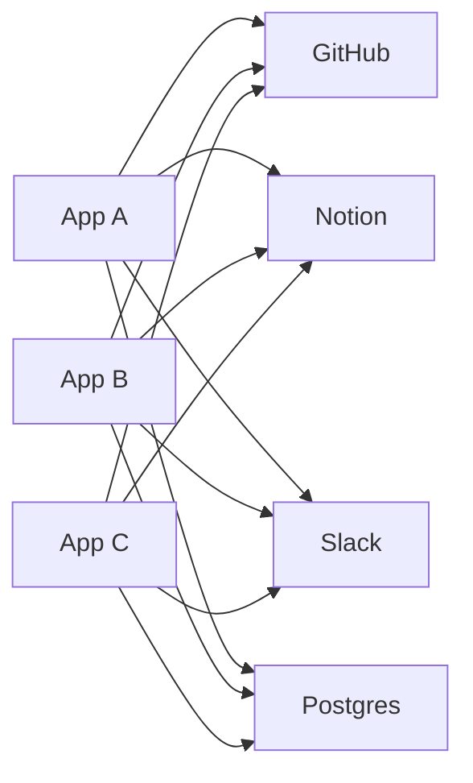
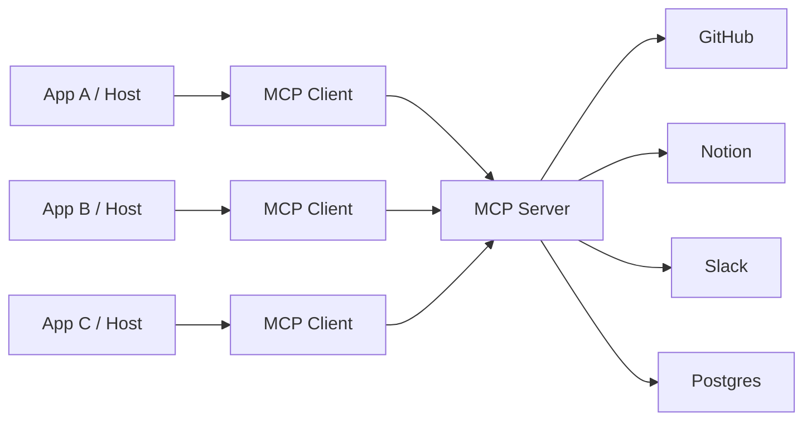
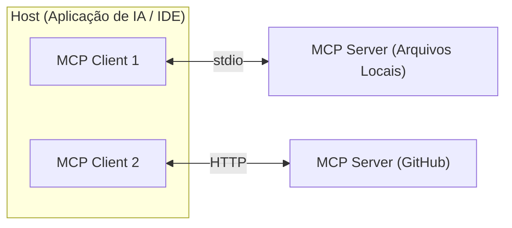
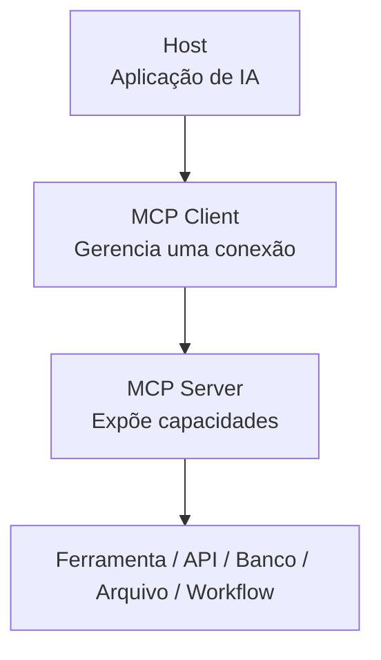
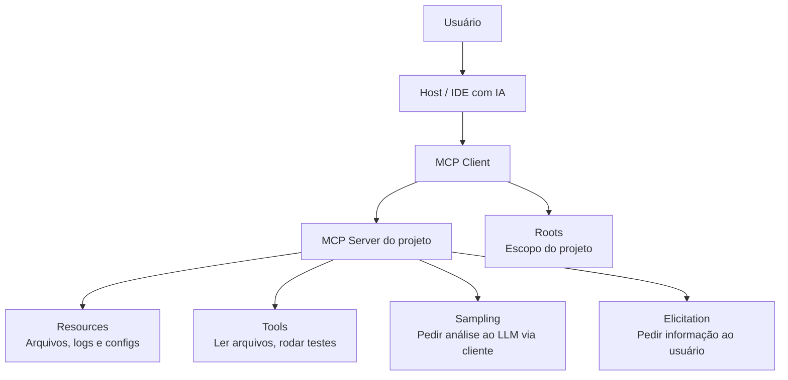

# Model Context Protocol (MCP): padronizando o contexto externo (Parte 2)

No [post anterior](), discutimos as limitações dos LLMs quando usados isoladamente e como os **agentes de IA** são construídos ao redor do modelo para fornecer ferramentas e contexto externo.

Mas à medida que aplicações com IA começaram a precisar acessar ferramentas externas, surgiu um problema de integração. É para resolver isso que o **MCP (Model Context Protocol)** foi criado.

Neste post, vamos entender:

- como o MCP surgiu;
- por que o MCP existe;
- como funciona a arquitetura Host, Client e Server;
- quais são as principais primitivas do MCP;
- quais cuidados de segurança entram nessa arquitetura.

## Como o MCP surgiu

O Model Context Protocol foi criado, anunciado e aberto ao público (open-source) pela **Anthropic** no final de **novembro de 2024**.

Embora lançado pela criadora do Claude, o MCP foi concebido desde o primeiro dia como um padrão universal e independente. A ideia é que ele seja adotado por toda a comunidade, sem se limitar a um único modelo de linguagem (LLM) ou ecossistema, formando uma rede aberta de ferramentas.

## Por que o MCP existe

Imagine vários aplicativos de IA precisando se conectar às mesmas ferramentas:

- GitHub;
- Slack;
- Notion;
- Postgres;
- Google Drive;
- Jira;
- APIs internas;
- sistemas de arquivos;
- sistemas corporativos.

Sem um padrão comum, cada aplicação precisa implementar seus próprios conectores para cada sistema.



Esse cenário gera o problema conhecido como integração **N × M**: muitos aplicativos tentando se conectar a muitas ferramentas diferentes.

O resultado costuma ser:

- duplicação de código;
- manutenção difícil;
- baixa portabilidade;
- integrações inconsistentes;
- regras de segurança espalhadas;
- dificuldade para reutilizar conectores entre aplicações.

O **Model Context Protocol** surge para padronizar essa camada de conexão entre aplicações de IA e sistemas externos.

Em vez de cada aplicação implementar todas as integrações diretamente, um **MCP Server** pode expor capacidades de forma padronizada. Aplicações compatíveis com MCP podem se conectar a esses servidores e descobrir quais ferramentas, dados e prompts estão disponíveis.



O MCP não substitui o LLM, não substitui a aplicação e também não resolve sozinho todos os problemas de segurança.

O papel dele é definir um protocolo comum para que aplicações de IA conversem com servidores que fornecem contexto e capacidades externas.

## Arquitetura do MCP

A arquitetura do MCP pode ser entendida a partir de três participantes principais:

```text
Host → Client → Server
```

Cada um tem uma responsabilidade diferente.

## Host: a aplicação de IA

O **Host** é a aplicação com a qual o usuário interage. Pode ser:

- um chat com IA;
- uma IDE;
- um assistente de produtividade;
- uma aplicação interna;
- um agente especializado.

O Host coordena a experiência geral. Ele gerencia o modelo, controla permissões, decide quais servidores podem ser usados e mantém a interface com o usuário.

Em uma IDE, por exemplo, o Host seria a própria IDE ou a extensão de IA. Em um chat corporativo, o Host seria a aplicação de chat que conecta o usuário ao modelo e aos servidores disponíveis.



## Client: a conexão com um servidor MCP

O **Client** é o componente dentro do Host que mantém a conexão com um servidor MCP específico.

Uma aplicação pode se conectar a vários servidores MCP. Normalmente, cada client mantém uma sessão isolada com um servidor.

Por exemplo:

```text
Host: IDE com IA

Client 1 → servidor MCP do sistema de arquivos
Client 2 → servidor MCP do GitHub
Client 3 → servidor MCP do banco de dados
```

Essa separação ajuda a manter isolamento entre servidores diferentes. Cada conexão pode ter suas próprias permissões, capacidades e regras de segurança.

## Server: quem expõe contexto e capacidades

O **Server** é o programa que fornece capacidades ao cliente MCP.

Ele pode expor:

- ferramentas executáveis;
- arquivos e dados como contexto;
- templates de prompts;
- acesso a APIs;
- integração com bancos de dados;
- workflows internos.

O servidor pode rodar localmente, como um processo na máquina do usuário, ou remotamente, como um serviço acessado pela rede.

O fluxo geral fica assim:



Essa separação é importante porque o MCP não coloca tudo dentro do modelo.

O modelo pode decidir que precisa de uma ferramenta, mas quem controla a conexão, valida permissões e executa ações é a aplicação ao redor dele.

## As duas camadas do MCP

O MCP pode ser visto em duas camadas principais:

- Camada de dados
- Camada de transporte

A **camada de dados** define o protocolo de mensagens entre clientes e servidores. É nela que aparecem conceitos como ciclo de vida da conexão, negociação de capacidades, requests, responses, notifications e primitivas como tools, resources e prompts.

A **camada de transporte** define como essas mensagens são transmitidas entre cliente e servidor.

Essa separação permite que o mesmo modelo de mensagens seja usado sobre diferentes formas de comunicação.

## Transporte no MCP

A comunicação entre cliente e servidor MCP usa mensagens baseadas em **JSON-RPC 2.0**. O transporte define como essas mensagens chegam de um lado ao outro.

A especificação do MCP define dois transportes padrão:

- **stdio**;
- **Streamable HTTP**.

### stdio: comunicação local por entrada e saída padrão

O transporte **stdio** é usado principalmente quando o servidor MCP roda como um processo local na mesma máquina do cliente.

Nesse modelo:

- o cliente inicia o servidor como subprocesso;
- o cliente envia mensagens pelo `stdin` do processo;
- o servidor responde pelo `stdout`;
- logs podem ser enviados pelo `stderr`.

Esse modelo é comum para integrações locais, como acesso a arquivos do projeto ou ferramentas de desenvolvimento executadas na máquina do usuário. A principal vantagem é a simplicidade. Não é necessário expor um endpoint HTTP nem manter um serviço remoto. A comunicação acontece diretamente entre processos.

**Na prática:** Isso significa que a sua aplicação de IA executa silenciosamente um processo no terminal (como um script Python, um pacote `npx` ou um container Docker local) e conversa com ele trocando textos de forma invisível. 

*(Dica: desenvolvedores frequentemente acessam máquinas remotas via túneis SSH para rodar o servidor. O túnel transporta os dados de ponta a ponta, mas para o protocolo MCP, a comunicação continua acontecendo via texto no console, mantendo o padrão `stdio`)*.


### Streamable HTTP: comunicação pela rede

O transporte **Streamable HTTP** é usado quando o servidor MCP roda como um serviço independente e precisa receber conexões pela rede.

Nesse modelo:

- o servidor oferece um endpoint HTTP;
- o cliente envia mensagens usando requisições HTTP;
- o servidor pode responder com JSON ou usar Server-Sent Events para streaming;
- mecanismos de autenticação podem ser aplicados no transporte.

Esse formato é mais adequado para cenários distribuídos, em que o servidor não está rodando dentro da mesma máquina do usuário. Por outro lado, ele exige mais atenção com segurança. Servidores HTTP precisam validar origem, autenticar chamadas, limitar permissões e evitar expor serviços locais de forma insegura.

**Na prática:** É como hospedar o servidor MCP na nuvem ou na rede da empresa como uma API Web tradicional. Múltiplas aplicações de IA diferentes podem consultar essa mesma API para acessar as mesmas ferramentas (como buscar dados corporativos ou processar pagamentos), exigindo os mesmos cuidados de segurança (CORS, Auth, etc) de qualquer API moderna.

## Primitivas do MCP

As primitivas são as capacidades fundamentais que clientes e servidores podem oferecer dentro do MCP.

Podemos separá-las em dois grupos:

```text
Servidor MCP expõe para o cliente:
- Tools
- Resources
- Prompts

Cliente MCP pode oferecer ao servidor:
- Roots
- Sampling
- Elicitation
```

Essa divisão é importante porque o MCP não é apenas um mecanismo para chamar ferramentas. Ele também define formas de compartilhar contexto, iniciar fluxos reutilizáveis, delimitar escopos e pedir informações adicionais ao usuário.

### Tools: ações que podem ser solicitadas

**Tools** são funções que um servidor MCP expõe para que uma aplicação de IA possa solicitar ações.

Elas podem servir para consultar uma API, buscar dados em um banco, criar uma issue, etc.

Uma tool normalmente possui:
- nome;
- descrição;
- schema de entrada;
- comportamento esperado;
- resultado retornado.

O ponto mais importante é: **o modelo não executa a ferramenta diretamente**. A execução real acontece no Host, no runtime, no framework ou no servidor responsável.

### Resources: dados usados como contexto

**Resources** são dados ou conteúdos que um servidor MCP disponibiliza para o cliente. Eles ajudam o modelo a responder com base em informações externas ao treinamento.

Exemplos de resources: `README.md`, schema do banco de dados, logs de erro. Cada resource é identificado por um URI.

A diferença entre uma tool e um resource é que o resource representa contexto, enquanto a tool representa ação.

### Prompts: templates reutilizáveis

**Prompts** no MCP são templates reutilizáveis de mensagens e instruções que servidores podem expor para clientes.

Eles servem para padronizar tarefas comuns. Por exemplo, um servidor pode expor prompts como: `resumir_documento`, `revisar_pull_request`.

O prompt não executa uma ação externa por conta própria. Ele organiza a instrução inicial para uma tarefa.

### Diferença entre MCP Prompt e Skill

Uma forma simples de pensar é:

**MCP Prompt é o ponto de partida da tarefa.**
**Skill é o método usado para executar bem a tarefa.**

Uma analogia simples é imaginar uma pizzaria.

Você é dono de uma pizzaria e tem um cliente antigo que sempre pede a “pizza de sempre”. Quando esse cliente faz o pedido, a pizzaria já tem uma ficha com as informações principais: pizza de calabresa, tamanho família, para viagem, com pagamento no cartão de crédito.

Nesse exemplo, o **MCP Prompt** funciona como essa ficha de pedido. Ele organiza as informações necessárias para iniciar a tarefa, como o sabor da pizza, o tamanho, a forma de pagamento e o modo de entrega. Em vez de explicar tudo do zero toda vez, o cliente usa um atalho, e a pizzaria já sabe quais campos precisam ser preenchidos.

Ou seja, o MCP Prompt representa um modelo pronto de solicitação. Ele recebe parâmetros e transforma esses dados em uma instrução mais completa para o modelo.

Já a **Skill** é o modo de preparo da pizzaria. Ela não é apenas o pedido em si, mas o conhecimento necessário para fazer a pizza bem. A skill envolve saber escolher uma farinha de boa qualidade, usar a proporção correta de água para cada quilo de farinha, preparar a massa do jeito certo, controlar o tempo de fermentação, distribuir os ingredientes corretamente e assar a pizza no ponto ideal.

Em outras palavras, a skill representa o método, as regras e a experiência usados para executar bem uma tarefa.

Nessa analogia, a **IA** seria como o pizzaiolo que interpreta o pedido e coordena o preparo. Ela entende o que precisa ser feito e aplica o processo correto. Mas, quando alguma ação externa precisa acontecer, entram as **tools**. As tools seriam os recursos da pizzaria, como o forno, o sistema de pagamento, o estoque de ingredientes ou o entregador.

Assim, cada parte tem uma função diferente:

| Analogia da pizzaria                          | Conceito técnico                  |
| --------------------------------------------- | --------------------------------- |
| Cliente pede “a pizza de sempre”              | Usuário faz uma solicitação curta |
| Ficha com sabor, tamanho, entrega e pagamento | MCP Prompt com parâmetros         |
| Pizzaiolo que entende o pedido                | IA/modelo                         |
| Modo de preparo da pizzaria                   | Skill                             |
| Forno, estoque, caixa e entregador            | Tools                             |
| Cardápio e lista de ingredientes              | Resources                         |

Trazendo isso para um exemplo técnico, imagine uma funcionalidade de revisão de Pull Request.

A **skill** seria responsável por ensinar o agente como revisar código corretamente. Ela poderia dizer que o agente deve verificar bugs, segurança, testes, legibilidade, impacto da mudança, riscos de regressão e critérios para aprovar ou pedir alterações.

Já o **MCP Prompt** seria o atalho que inicia uma revisão específica. Ele recebe informações como o repositório, o número da PR e o foco da análise.

### Fluxo de uma chamada de tool

Uma chamada de tool normalmente segue este fluxo:

1. O usuário faz uma solicitação.
2. A aplicação envia a mensagem e as tools disponíveis para o modelo.
3. O modelo decide se precisa solicitar alguma tool.
4. Se precisar, ele retorna uma tool call com nome e argumentos.
5. A aplicação valida argumentos, permissões e contexto.
6. A tool é executada pelo runtime, framework ou servidor.
7. O resultado volta para o modelo.
8. O modelo usa o resultado para responder ao usuário.

### Roots: delimitando o escopo de atuação

**Roots** são uma primitive do lado do cliente. Elas permitem que o cliente informe ao servidor quais diretórios ou arquivos fazem parte do escopo de uma tarefa.

Com roots, o servidor pode entender melhor onde deve operar, não precisando conhecer todo o sistema de arquivos do usuário.

### Sampling: quando o servidor pede uma chamada ao modelo

**Sampling** permite que um servidor MCP solicite ao cliente uma geração de modelo de linguagem. Isso é útil quando o servidor precisa usar capacidades de IA, mas não deve chamar um LLM diretamente nem possuir suas próprias credenciais de modelo.

### Elicitation: pedindo informações adicionais ao usuário

**Elicitation** permite que um servidor MCP peça informações adicionais ao usuário por meio do cliente. Útil quando o servidor precisa continuar uma tarefa, mas faltam dados.

## Exemplo completo: MCP dentro de uma IDE

Imagine uma aplicação de IA dentro de uma IDE. O usuário pede:

```text
Analise este projeto e crie um resumo dos principais problemas.
```

Um fluxo possível seria:

```text
1. O cliente define um root (ex: projeto).
2. O servidor usa esse root para entender o escopo do projeto.
3. O servidor expõe resources (ex: README, logs).
4. O servidor expõe tools (ex: listar_arquivos).
5. O servidor pode usar sampling.
6. Se faltar informação, o servidor usa elicitation.
7. O usuário responde.
8. O servidor continua o fluxo.
9. A aplicação entrega o resumo final ao usuário.
```

Visualmente:



Esse exemplo mostra o valor do MCP: organizar a comunicação entre aplicação, modelo, ferramentas, dados e usuário.

## Cuidados de segurança

O MCP ajuda a padronizar integrações, mas não elimina a necessidade de segurança na aplicação.

Alguns cuidados importantes:

- validar argumentos antes de executar tools;
- pedir confirmação para ações sensíveis;
- limitar permissões de cada servidor;
- separar servidores por responsabilidade;
- não expor diretórios desnecessários como roots;
- evitar que elicitation peça segredos ou credenciais;
- autenticar corretamente servidores remotos;
- validar origem em transportes HTTP;
- registrar ações relevantes para auditoria;
- tratar respostas de tools como dados não confiáveis até serem validadas.

Um erro comum é imaginar que, por existir um protocolo, a integração fica automaticamente segura. A segurança depende das decisões de implementação. Para se aprofundar nos riscos e vulnerabilidades ao construir aplicações desse tipo, recomendo fortemente a leitura do [OWASP Top 10 para LLMs](https://genai.owasp.org/llm-top-10/).

## Quando usar MCP

MCP faz mais sentido quando a aplicação de IA precisa se conectar a ferramentas ou fontes de dados externas de forma padronizada. Bons cenários incluem:

- assistentes dentro de IDEs;
- agentes que precisam consultar sistemas internos;
- aplicações que integram várias ferramentas;
- ambientes em que diferentes clientes podem reutilizar os mesmos servidores;
- fluxos em que contexto, ferramentas e prompts precisam ser expostos de forma organizada.

Por outro lado, MCP pode ser excesso para casos simples (ex: chamar uma ou duas funções internas, sem necessidade de reutilização).

A pergunta principal não é “MCP é bom?”, mas sim:

```text
O problema que estou resolvendo justifica uma camada padronizada de integração?
```

## Resumo comparativo

| Conceito | Responsabilidade | Exemplo |
|---|---|---|
| LLM | Gerar e interpretar linguagem | Responder uma pergunta ou explicar código |
| Agente | Usar modelo, instruções, contexto e ferramentas para resolver tarefas | Assistente que analisa um projeto e executa testes |
| Host | Aplicação com a qual o usuário interage | Chat, IDE, app interno |
| Client | Conexão entre Host e Server | Cliente MCP conectado a um servidor de arquivos |
| Server | Expõe capacidades e contexto | Servidor MCP do GitHub ou Postgres |
| Tool | Executa uma ação | Criar issue, rodar teste, consultar API |
| Resource | Fornece contexto | README, schema, log, documento |
| Prompt | Template reutilizável de instrução | `review_pull_request` |
| Root | Escopo informado pelo cliente | Pasta do projeto atual |
| Sampling | Servidor pede geração de LLM via cliente | Explicar função complexa |
| Elicitation | Servidor pede informação ao usuário via cliente | Perguntar prazo de uma tarefa |

## Conclusão

O MCP entra como uma camada de padronização para conectar aplicações de IA a sistemas externos. Ele organiza a comunicação entre Host, Client e Server e define primitivas como Tools, Resources, Prompts, Roots, Sampling e Elicitation.

Seu valor não está em “dar poderes mágicos” ao modelo, mas em criar uma forma mais clara, reutilizável e controlada de expor capacidades para aplicações com IA.

A ideia principal é:

```text
MCP padroniza a conexão com contexto e ferramentas.
A aplicação controla permissões, validações e execução.
```

Entender essa separação é essencial para construir sistemas com IA que sejam úteis, seguros e fáceis de evoluir.

## Referências

- https://medium.com/@robertocorreamoreiraneto/mcp-model-context-protocol-6875f5cfa142
- [https://modelcontextprotocol.io/docs/getting-started/intro](https://modelcontextprotocol.io/docs/getting-started/intro)
- [https://modelcontextprotocol.io/docs/learn/architecture](https://modelcontextprotocol.io/docs/learn/architecture)
- [https://modelcontextprotocol.io/clients](https://modelcontextprotocol.io/clients)
- [https://modelcontextprotocol.io/examples](https://modelcontextprotocol.io/examples)
- [https://modelcontextprotocol.io/seps](https://modelcontextprotocol.io/seps)
- [https://modelcontextprotocol.io/specification/2025-11-25](https://modelcontextprotocol.io/specification/2025-11-25)
- [https://modelcontextprotocol.io/docs/tools/inspector](https://modelcontextprotocol.io/docs/tools/inspector)
- [https://www.tomshardware.com/tech-industry/artificial-intelligence/anthropics-model-context-protocol-has-critical-security-flaw-exposed](https://www.tomshardware.com/tech-industry/artificial-intelligence/anthropics-model-context-protocol-has-critical-security-flaw-exposed)
- [https://cloud.google.com/discover/what-is-model-context-protocol](https://cloud.google.com/discover/what-is-model-context-protocol)
- https://ssojet.com/blog/what-tech-leaders-need-to-know-about-mcp-authentication-in-2025#what-is-mcp-and-why-should-you-care
- [https://en.wikipedia.org/wiki/Model_Context_Protocol](https://en.wikipedia.org/wiki/Model_Context_Protocol)
- https://modelcontextprotocol.io/docs/learn/client-concepts#elicitation
- [https://sitespeak.ai/ai-chatbot-terms/nxm-integration-problem](https://sitespeak.ai/ai-chatbot-terms/nxm-integration-problem)

