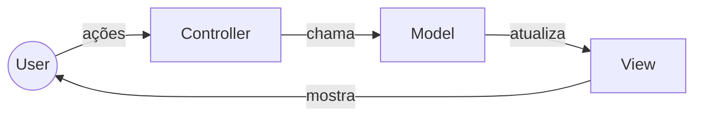

> Descrição:  o objetivo ou o tema do curso/projeto.

# 1- second posts (MVC)

Lorem ipsum dolor sit amet, consectetur adipiscing elit. Sed molestie ipsum vitae quam dictum, sed pharetra magna tincidunt. Vestibulum dapibus efficitur molestie. Cras aliquam leo nulla. In elementum ut nunc et luctus. Proin venenatis interdum purus, et posuere dolor luctus eu. Donec blandit semper nisi et sagittis. Cras id ante elementum, pulvinar metus nec, pretium turpis. Nunc et semper tortor. Nam ullamcorper volutpat ante, sed consectetur magna. Ut varius, tortor eu sollicitudin posuere, turpis nisl accumsan ex, vel maximus est tellus faucibus metus. Pellentesque aliquet massa et enim elementum, eu eleifend lectus ultrices. Curabitur in rutrum velit. Sed in ex gravida, vestibulum velit a, sagittis est. Phasellus congue pharetra quam eget gravida. Praesent vitae lectus ex. Suspendisse eros tellus, tincidunt et fringilla at, ullamcorper ac orci.

## Funcionamento

Lorem ipsum dolor sit amet, consectetur adipiscing elit. Sed molestie ipsum vitae quam dictum, sed pharetra magna tincidunt. Vestibulum dapibus efficitur molestie. Cras aliquam leo nulla. In elementum ut nunc et luctus. Proin venenatis interdum purus, et posuere dolor luctus eu. Donec blandit semper nisi et sagittis. Cras id ante elementum, pulvinar metus nec, pretium turpis. Nunc et semper tortor. Nam ullamcorper volutpat ante, sed consectetur magna. Ut varius, tortor eu sollicitudin posuere, turpis nisl accumsan ex, vel maximus est tellus faucibus metus. Pellentesque aliquet massa et enim elementum, eu eleifend lectus ultrices. Curabitur in rutrum velit. Sed in ex gravida, vestibulum velit a, sagittis est. Phasellus congue pharetra quam eget gravida. Praesent vitae lectus ex. Suspendisse eros tellus, tincidunt et fringilla at, ullamcorper ac orci.

> [!note] 
> No Smalltalk, o Model tinha a capacidade de notificar diretamente a View, sem passar pelo Controller. Já nas linguagens modernas, o Controller assume a responsabilidade de intermediar a camada de View, o que reforça a separação de responsabilidades e reduz o acoplamento entre Model e View.

> [!important]
> Key information users need to know to achieve their goal.

> [!tip]
> Helpful advice for doing things better or more easily.

> [!caution]
> Advises about risks or negative outcomes of certain actions.

> [!warning]
> Urgent info that needs immediate user attention to avoid problems.

## Quando utilizar?

**Vantagens:**

Lorem ipsum dolor sit amet, consectetur adipiscing elit. Sed molestie ipsum vitae quam dictum, sed pharetra magna tincidunt. Vestibulum dapibus efficitur molestie. Cras aliquam leo nulla. In elementum ut nunc et luctus. Proin venenatis interdum purus, et posuere dolor luctus eu. Donec blandit semper nisi et sagittis. Cras id ante elementum, pulvinar metus nec, pretium turpis. Nunc et semper tortor. Nam ullamcorper volutpat ante, sed consectetur magna. Ut varius, tortor eu sollicitudin posuere, turpis nisl accumsan ex, vel maximus est tellus faucibus metus. Pellentesque aliquet massa et enim elementum, eu eleifend lectus ultrices. Curabitur in rutrum velit. Sed in ex gravida, vestibulum velit a, sagittis est. Phasellus congue pharetra quam eget gravida. Praesent vitae lectus ex. Suspendisse eros tellus, tincidunt et fringilla at, ullamcorper ac orci.

**Desvantagens:**
Lorem ipsum dolor sit amet, consectetur adipiscing elit. Sed molestie ipsum vitae quam dictum, sed pharetra magna tincidunt. Vestibulum dapibus efficitur molestie. Cras aliquam leo nulla. In elementum ut nunc et luctus. Proin venenatis interdum purus, et posuere dolor luctus eu. Donec blandit semper nisi et sagittis. Cras id ante elementum, pulvinar metus nec, pretium turpis. Nunc et semper tortor. Nam ullamcorper volutpat ante, sed consectetur magna. Ut varius, tortor eu sollicitudin posuere, turpis nisl accumsan ex, vel maximus est tellus faucibus metus. Pellentesque aliquet massa et enim elementum, eu eleifend lectus ultrices. Curabitur in rutrum velit. Sed in ex gravida, vestibulum velit a, sagittis est. Phasellus congue pharetra quam eget gravida. Praesent vitae lectus ex. Suspendisse eros tellus, tincidunt et fringilla at, ullamcorper ac orci.

# Referências

## Internas:

- 

## Externas:

- https://en.wikipedia.org/wiki/Model%E2%80%93view%E2%80%93controller
- https://www.geeksforgeeks.org/software-engineering/mvc-framework-introduction/
- https://developer.mozilla.org/en-US/docs/Glossary/MVC
- https://www.startertutorials.com/patterns/design-patterns-smalltalk-mvc.html
- https://www.tedinski.com/2018/09/04/mvc-origin-story.html
- https://www.devmedia.com.br/introducao-ao-padrao-mvc/29308

