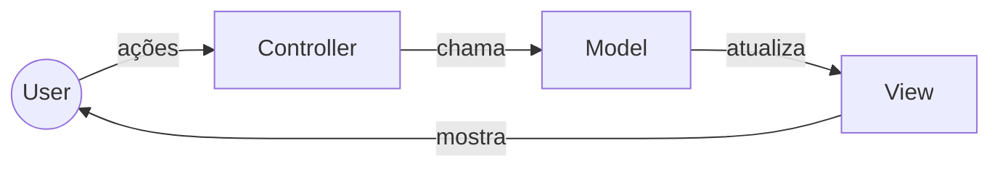

O conceito Model View Controller (MVC) é um padrão de projeto voltado à estruturação da interface e da interação entre dados, lógica e apresentação criado por Trygve Reenskaug na década de 1970, enquanto ele trabalhava com Smalltalk.  
Inicialmente, o padrão foi pensado para aplicações desktop com interfaces gráficas (GUIs), mas acabou se tornando extremamente popular no desenvolvimento web, especialmente com frameworks como Ruby on Rails, ASP.NET MVC e Spring MVC.  

Ao longo do tempo, surgiram variações do MVC, adaptadas a diferentes contextos. Um exemplo famoso é o Model Template View (MTV) do framework Django (Python).  

O padrão também foi documentado e discutido em profundidade no livro "Patterns of Enterprise Application Architecture" (2002), de Martin Fowler, que ajudou a consolidar e difundir o uso de arquiteturas baseadas em camadas e padrões de UI como o MVC.  

## Funcionamento

O padrão Model–View–Controller (MVC) divide a aplicação em três componentes principais, cada um com responsabilidades bem definidas:

* **Model**  - É a parte central da aplicação.
	- Armazena e gerencia as estruturas de dados.
	- Contém a **lógica de negócio** e as **regras da aplicação**.
	- É independente da interface do usuário, ou seja, pode ser reutilizado em diferentes tipos de interface (ex.: web, desktop, mobile).
- **View**  -  É a camada que representa o que o usuário vê e interage.
	- Responsável pela apresentação dos dados (ex.: páginas HTML, templates, respostas JSON, etc.).
    - Não contém regras de negócio, apenas a exibição.
* **Controller**  - É responsável por receber as entradas do usuário (requisições, cliques, formulários, etc.).
	- Converte essas entradas em ações para o Model.
	- Faz a ponte entre a View e o Model, coordenando a comunicação.
	- Pode executar validações básicas, preparar dados ou orquestrar fluxos antes de delegar ao Model.
	- Em resumo, o Controller atua como intermediário entre Model e View.

> [!note] Curiosidade:
> No Smalltalk, o Model tinha a capacidade de notificar diretamente a View, sem passar pelo Controller. Já nas linguagens modernas, o Controller assume a responsabilidade de intermediar a camada de View, o que reforça a separação de responsabilidades e reduz o acoplamento entre Model e View.

## Quando utilizar?

**Vantagens:**

- Independência entre camadas: separa a camada de apresentação da de dados.
- Reaproveitamento do modelo: a lógica de negócio pode ser usada em diferentes interfaces (web, desktop, API, etc.).
- Redução de dependências: diminui o acoplamento entre componentes, facilitando a manutenção.
- Facilidade de testes: cada camada pode ser testada isoladamente (ex.: testes unitários no modelo).
- Maior organização do código: cada parte do sistema tem sua responsabilidade bem definida.

**Desvantagens:**

* Dificuldade em projetos **muito** pequenos: em sistemas simples, o MVC pode parecer um exagero, trazendo mais trabalho do que benefício.
* Em sistemas complexos, Controllers tendem a crescer demais.
* Não separa suficientemente a lógica de negócio em sistemas de larga escala.

## Conclusão 

O MVC é um excelente padrão para a camada de apresentação e funciona muito bem em projetos simples. Porém, conforme a aplicação cresce, ele se torna limitado, especialmente para organizar regras de negócio mais complexas.  
Nesses casos, é comum adicionar novos elementos que não fazem parte do MVC, como _services_, _use cases_, _repositories_ e outros componentes que pertencem a arquiteturas diferentes, usadas para estruturar o domínio e a lógica interna da aplicação.
# Referências

- https://en.wikipedia.org/wiki/Model%E2%80%93view%E2%80%93controller
- https://www.geeksforgeeks.org/software-engineering/mvc-framework-introduction/
- https://developer.mozilla.org/en-US/docs/Glossary/MVC
- https://www.startertutorials.com/patterns/design-patterns-smalltalk-mvc.html
- https://www.tedinski.com/2018/09/04/mvc-origin-story.html
- https://www.devmedia.com.br/introducao-ao-padrao-mvc/29308
