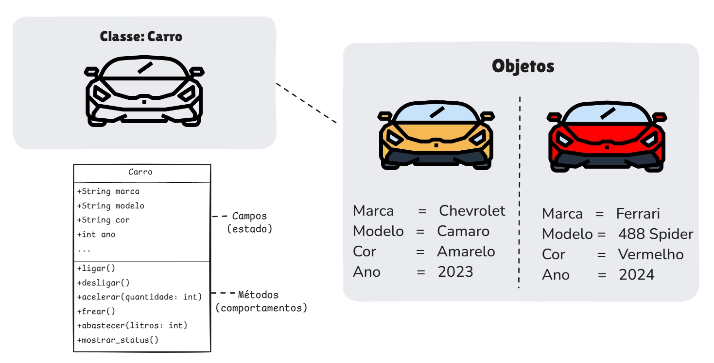
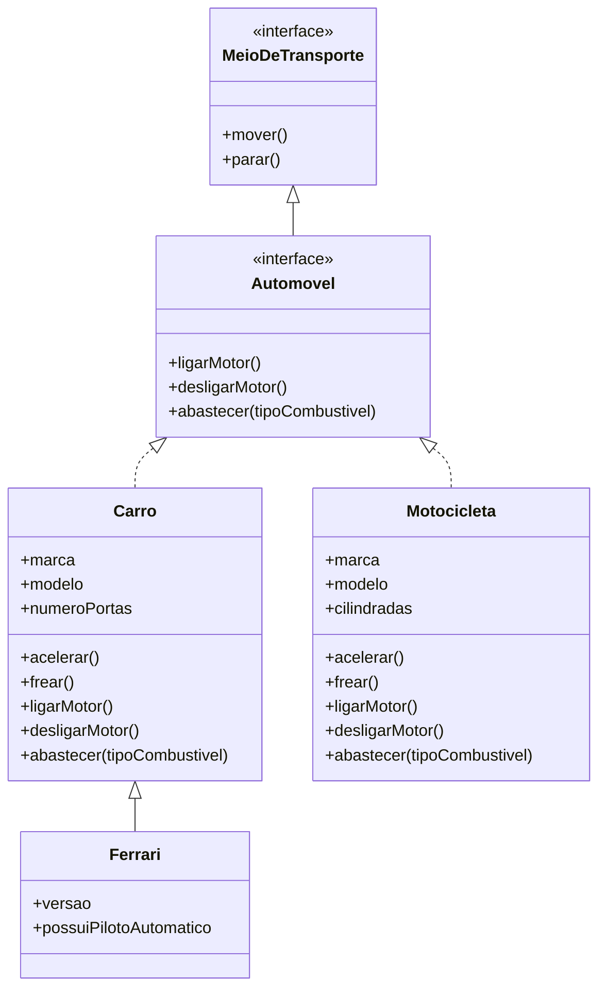
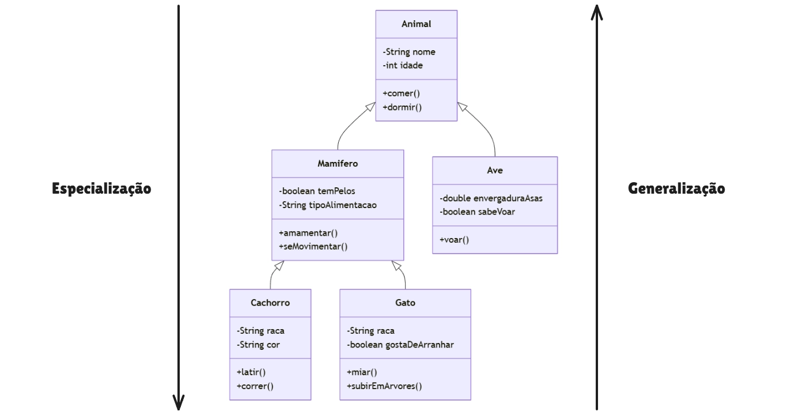
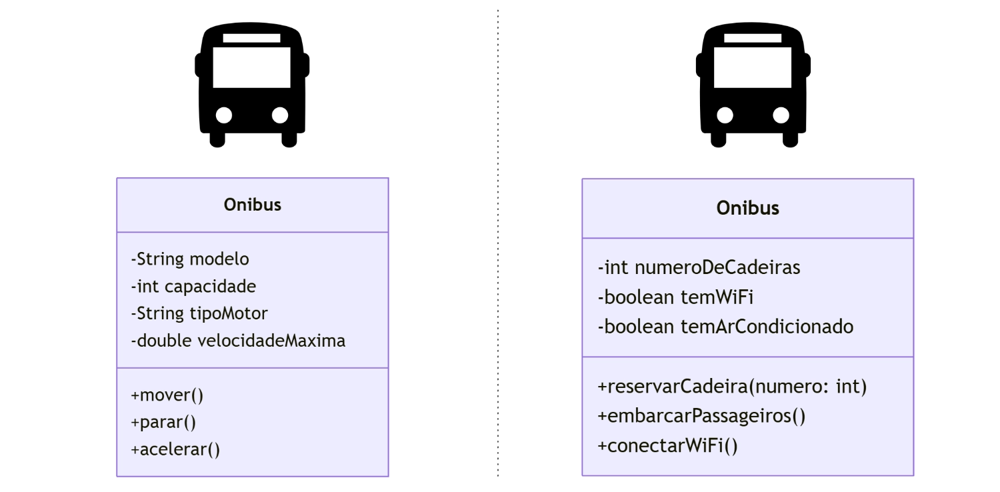
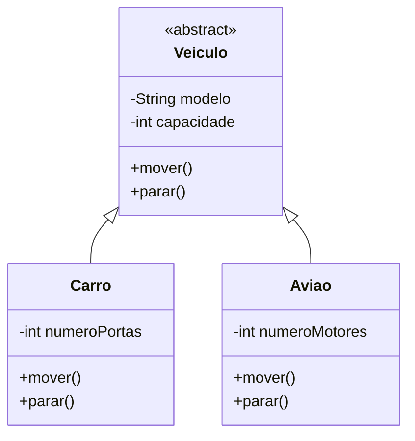

## Como surgiu POO?

A Programação Orientada a Objetos (POO) surgiu na década de 1960 com a linguagem Simula, desenvolvida por Ole-Johan Dahl e Kristen Nygaard no Centro de Computação Norueguês. O objetivo inicial era criar simulações complexas, especialmente para representar sistemas reais com entidades interagindo entre si.

O conceito foi posteriormente refinado e popularizado com a linguagem Smalltalk, criada nos anos 1970 no Xerox PARC. Smalltalk consolidou ideias como encapsulamento, herança e polimorfismo, tornando a POO um paradigma amplamente adotado.

A partir dos anos 1980 e 1990, linguagens como C++, Java e Python expandiram a adoção da POO, tornando-a um dos paradigmas mais utilizados no desenvolvimento de software moderno.

## **Conceitos básicos de classes e objetos?**

**Classe**:
Uma **classe** é um molde ou modelo para criar objetos. Ela define os atributos (dados) e os métodos (funções) que os objetos terão. Como se fosse uma receita de bolo.

**Objeto**:
Um **objeto** é uma instância de uma classe, ou seja, um elemento criado com base na estrutura definida pela classe. Cada objeto pode ter diferentes valores nos atributos.

Os elementos de um objeto se dividem em duas categorias principais: **propriedades e métodos.**

* As **propriedades**, também conhecidas como **atributos**, incluem informações sobre o objeto.
* Os **métodos** definem as operações que podem ser executadas no objeto.

Na imagem a seguir, temos uma classe chamada `Carro`, que define alguns estados (atributos) e comportamentos (métodos).
A partir dessa classe, foram instanciados dois objetos, ambos do tipo `Carro`, mas com valores diferentes em seus atributos, como podemos observar.



> [!NOTE]
> Os dados armazenados dentro dos campos do objeto são referenciados como estado e todos os  métodos (funções) de um objeto definem seu comportamento.

Em resumo:

* **Classe** → Define as características e comportamentos (o modelo).
* **Objeto** → Uma entidade criada com base na classe, com valores próprios.
* **Método** → Representa as ações ou comportamentos que o objeto realiza.
* **Atributo** → São as propriedades ou dados do objeto

## **Pilares da POO**

A Programação Orientada a Objetos é baseada em quatro princípios fundamentais, conhecidos como os pilares da POO. São eles:

- **[Encapsulamento](#encapsulamento)**
    - Protege os dados dentro dos objetos, permitindo o acesso apenas por meio de métodos específicos.
    - Utiliza modificadores de acesso como `private`, `protected` e `public`.

- **[Herança](#herança)**
    - Permite que uma classe (subclasse) herde atributos e métodos de outra (superclasse).
    - Facilita a reutilização de código e a organização hierárquica.

- **[Polimorfismo](#polimorfismo)**
    - Permite que métodos com o mesmo nome tenham comportamentos diferentes dependendo da classe que os implementa.
    - Pode ser feito por sobrecarga (métodos com mesmo nome, mas diferentes parâmetros) e sobrescrita (métodos redefinidos em subclasses).

- **[Abstração](#abstração)**
    - Oculta detalhes complexos da implementação, expondo apenas as funcionalidades essenciais.
    - Usa classes abstratas  para definir um "molde" para outras classes.

### **Encapsulamento**

O _Encapsulamento_ tem como objetivo impedir o vazamento de escopo, garantindo que atributos e métodos sejam acessíveis apenas por quem realmente deve vê-los. Para isso, utiliza modificadores de acesso, permitindo um controle mais preciso sobre a visibilidade e a manipulação dos dados. Isso facilita a identificação do estado de cada variável em tempo de execução e ajuda a determinar quais partes do código podem modificá-la.

 **Modificadores de acesso:**

- **`public` (Público)** → Pode ser acessado de qualquer lugar do código.
- **`private` (Privado)** → Só pode ser acessado dentro da própria classe.
- **`protected` (Protegido)** → Pode ser acessado dentro da própria classe e em classes que herdam dela.

Na imagem abaixo, representação dos níveis de acesso. O losango indica os métodos e os círculos, os atributos. A cor verde simboliza o modificador `public`, o amarelo representa o `protected`, e o vermelho, o `private`.


Em resumo, o _Encapsulamento_ permite ocultar determinados estados e comportamentos de um objeto, expondo apenas uma interface controlada para o restante do programa.

Na maioria das linguagens de programação, interfaces e classes/métodos abstratos são baseados nos princípios de **abstração** e **encapsulamento**. O objetivo da interface é definir contratos de interação entre objetos, focando nos comportamentos que eles devem possuir.

**Métodos de acesso (Setters & Getters)**

Um ponto que vale destaca brevemente que são os métodos especiais definidos para atribuir valores às propriedades do objeto e para recuperar os valores previamente definidos respectivamente;

- Métodos Setters fazem atribuições de valores passados ao método aos atributos do objeto (propriedades), são nomeados normalmente iniciando com a palavra set, seguindo do nome do atributo e de acordo com a boa prática de programação.
- Métodos Getters buscam valores armazenados nos atributos do objeto (propriedades), retornando esses valores ao sistema, são nomeados normalmente iniciando com a palavra get, seguindo do nome do atributo e de acordo com a boa prática de programação.

> [!NOTE]  Interface
> O conceito de **interface** é frequentemente associado aos pilares da **Abstração** e, em alguns livros, também ao **Encapsulamento**. Isso ocorre porque a interface **define um contrato** sem expor detalhes de implementação (**abstração**) e **restringe o acesso** apenas aos métodos essenciais, ocultando a lógica interna (**encapsulamento**).



Quando duas ou mais classes possuem comportamentos comuns, esses comportamentos podem ser extraídos para uma **interface**. Diferente de uma classe, uma interface não é herdada, mas **implementada**, funcionando como um **contrato**: qualquer classe que a implementar deve fornecer todas as definições de seus métodos.

Por exemplo, as classes _Carro_ e _Motocicleta_ podem implementar a interface _Automóvel_, permitindo que qualquer objeto dessas classes seja tratado como um automóvel. Além disso, interfaces podem herdar de outras interfaces, criando uma hierarquia. Exemplo: _Automóvel_ pode herdar de _MeioDeTransporte_, pois um carro e uma carroça são meios de transporte, mas apenas o carro é um automóvel.

### **Herança**

Quando dizemos que uma classe **A** é um tipo de classe B, significa que a classe A herda as características da classe B. Nesse caso, a classe B é a **superclasse**, também chamada de **classe mãe, classe base ou ancestral**, enquanto a classe A é sua **subclasse**. Essa relação representa o conceito de **herança** na programação orientada a objetos.

A principal vantagem da herança é a **reutilização de código**, evitando duplicação e permitindo a extensão da funcionalidade da superclasse dentro da subclasse. A subclasse herda todos os atributos e métodos da superclasse, podendo ainda adicionar ou modificar comportamentos conforme necessário.

### Hierarquias de classes

A **hierarquia de classes** na **Programação Orientada a Objetos (POO)** representa a estrutura de herança entre classes, organizando-as de forma que classes mais gerais ficam no topo e classes mais específicas derivam delas.



A classe `Animal` é uma **superclasse**, enquanto as classes que a herdam, como `Mamifero` e `Ave`, são chamadas de **subclasses**. As subclasses herdam os **atributos** e **comportamentos** da superclasse, podendo também adicionar ou sobrescrever funcionalidades específicas, por exemplo os métodos `latir` e `miar`.

Algumas linguagens de programação permitem que uma subclasse herde de múltiplas superclasses, um conceito conhecido como **herança múltipla**, enquanto outras restringem a herança a apenas uma única superclasse, adotando o modelo de **herança única**. Linguagens como **C++ e 1 - Python** suportam herança múltipla, permitindo que uma classe herde atributos e métodos de várias classes-base. Já linguagens como **Java e C#** evitam a herança múltipla de classes para reduzir a complexidade e problemas como o **"diamond problem"** (problema do diamante), que ocorre quando múltiplas heranças levam a ambiguidades na resolução de métodos e atributos.

### **Polimorfismo**

A palavra "polimorfismo" tem origem no grego, onde _poli_ significa "muitas" e _morphos_ significa "formas". Esse conceito se encaixa perfeitamente na Programação Orientada a Objetos (POO), pois permite que métodos herdados de uma classe mãe sejam redefinidos de diferentes formas pelas subclasses. Dessa maneira, cada subclasse pode implementar um comportamento específico para um mesmo método, garantindo flexibilidade e reutilização de código. O polimorfismo pode ocorrer por sobreposição (_override_), quando um método herdado é redefinido, ou por sobrecarga (_overload_), quando métodos com o mesmo nome possuem assinaturas diferentes.

 ```mermaid
 classDiagram
    class Animal {
        +falar() String
    }

    class Cachorro {
        +falar() String
    }

    class Gato {
        +falar() String
    }

    Animal <|-- Cachorro
    Animal <|-- Gato

    Animal : falar() -> "Som genérico"
    Cachorro : falar() -> "Latido"
    Gato : falar() -> "Miado"

```

### **Abstração**

Abstração, de forma geral, consiste em representar um objeto real no mundo das ideias, destacando apenas suas características essenciais e ignorando detalhes desnecessários ou complexos.

Na Programação Orientada a Objetos (POO), você cria objetos no computador que representam entidades do mundo real, modelando seus atributos e comportamentos dentro de um contexto específico, destacando o que é relevante e omitindo detalhes desnecessários.

Exemplo a seguir mostra uma classe `Onibus`, onde uma versão foca nas informações técnicas do veículo e a outra nas funcionalidades oferecidas aos passageiros.



Uma classe abstrata tem como objetivo fornecer um modelo para outras classes, dizendo o que precisa ser feito, **mas** **sem definir exatamente como será feito**. Ela não pode ser usada sozinha, sendo necessária a criação de classes que herdem dela. Mesmo assim, uma classe abstrata pode ter comportamentos prontos para serem usados, além de deixar espaço para que as subclasses completem ou adaptem o que for necessário.



Uma classe abstrata serve para modelar objetos que possuam características semelhantes, mas ainda assim, tenham comportamentos distinto para ações semelhantes

## Vantagens e Desvantagens da Programação Orientada a Objetos (POO)

### Vantagens

- **Reutilização de código:** ao aplicar corretamente os princípios da POO é possível reaproveitar partes do código em diferentes contextos, aumentando a produtividade e reduzindo retrabalho.
- **Modularidade:** o código é dividido em classes e objetos independentes, o que facilita a manutenção, a leitura e o reaproveitamento. Essa estrutura modular também traz **flexibilidade** e **escalabilidade** ao sistema.
- **Facilidade de manutenção:** quando bem projetado, o código orientado a objetos permite modificar partes específicas sem afetar outras áreas do sistema.
- **Maior clareza e organização:** o modelo de classes e objetos aproxima o código da forma como o mundo real é percebido, tornando o desenvolvimento mais intuitivo.
- **Encapsulamento:** ajuda a proteger dados e restringir o acesso direto a atributos internos, mantendo a integridade e segurança do sistema.

### Contras

- **Curva de aprendizado mais alta:** compreender e aplicar corretamente os conceitos de POO (como herança, abstração e polimorfismo) exige mais tempo e prática, especialmente para iniciantes.
- **Maior complexidade:** o uso excessivo ou incorreto de abstrações pode tornar o código difícil de entender e manter.
- **Dependência de boas práticas:** se os princípios de design (como SOLID) não forem seguidos, o código pode se tornar rígido, acoplado e difícil de evoluir.
- **Mais esforço inicial:** projetar corretamente as classes e suas relações exige mais planejamento no início do desenvolvimento.

## Conclusão

A Programação Orientada Objeto é poderoso quando aplicado de forma correta e com responsabilidade, oferece uma organização, reuso e manutenção facilitada, mas exige disciplina e bom design para que a complexidade do código não torne-se um problema.

Neste post, vimos os pilares da Programação Orientada a Objetos de forma simples e visual.  
Se quiser ver funcionando na prática, confira o repositório com os exemplos de código: 
- https://github.com/biaggiorizzo/blog-oop-examples.git

# Referências

- https://pt.wikipedia.org/wiki/Programa%C3%A7%C3%A3o_orientada_a_objetos#Hist%C3%B3ria
- https://www.alura.com.br/artigos/poo-programacao-orientada-a-objetos
- https://www.devmedia.com.br/os-4-pilares-da-programacao-orientada-a-objetos/9264
- https://refactoring.guru/pt-br/design-patterns/book