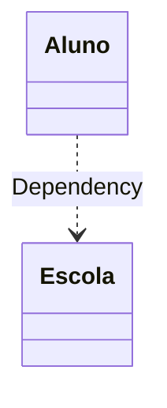
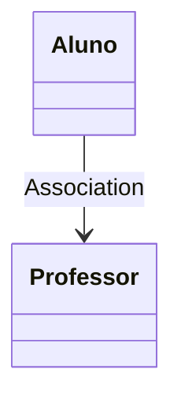
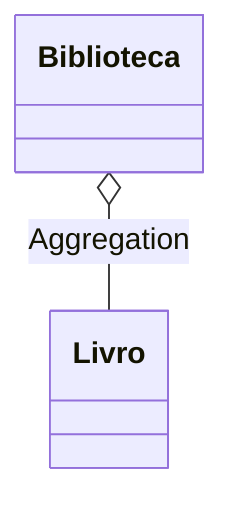
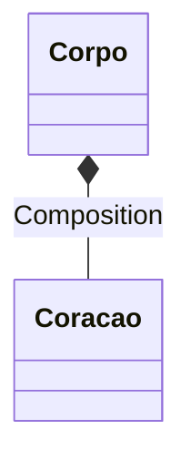

> As **relações entre objetos** representam como as classes interagem entre si.

### Dependência

A **dependência** é a forma mais fraca de relação entre classes, ocorrendo quando uma depende da outra para operar. Caso uma delas sofra alterações, a outra pode ser impactada. Esse vínculo acontece, por exemplo, ao instanciar objetos diretamente ou ao definir tipos específicos em métodos.

Para reduzir essa dependência, é melhor programar usando **interfaces ou classes abstratas**, tornando o código mais flexível.

Trecho ilustrativo:


class Aluno {
    public void estudar(Escola escola) { // usa Escola como parâmetro
        escola.fornecerMaterial();
    }
}


Nesse exemplo, o método `estudar` depende da classe `Escola`, pois precisa de um objeto para funcionar. A  dependência é **temporária**, não armazena uma referência permanente na classe `Aluno`.

[Veja o código completo no GitHub -> Dependência](https://github.com/biaggiorizzo/biaggio-blog-code/blob/main/concepts/poo/object-relationships/java/Example/src/main/java/org/example/Dependency.java)

### Associação

Se **Aluno** está associado a **Professor**, significa que há uma relação entre eles, mas **Aluno** não depende diretamente de **Professor** para existir.

A diferença entre **dependência** e **associação** é que, na dependência, modificar ou remover a classe referenciada pode quebrar o código. Já na associação, os objetos se relacionam, mas um pode existir sem o outro.

Por exemplo, se um **Aluno** tem um **Professor** associado, remover a classe **Professor** não impede que **Aluno** continue existindo. No entanto, se **Aluno** dependesse diretamente de **Professor** (por exemplo, instanciando um objeto dentro dele), sua remoção poderia causar erros no código.

Trecho ilustrativo:


class Aluno {
    Professor professor; // Associação

    public void setProfessor(Professor professor) {
        this.professor = professor; // Associação sendo formada
    }
}


Mesmo que a associação com `Professor` seja removida, a classe `Aluno` continua funcionando normalmente, pois não depende dela para existir.

[Veja o código completo no GitHub -> Associação](https://github.com/biaggiorizzo/biaggio-blog-code/blob/main/concepts/poo/object-relationships/java/Example/src/main/java/org/example/Association.java)

### Agregação

**Agregação** é um tipo especializado de **associação** que descreve relações **whole-part** (todo-parte), **one-to-many** (um-para-muitos) ou **many-to-many** (muitos-para-muitos) entre objetos. Diferente da associação simples, que conecta apenas dois objetos, a agregação envolve um objeto que "tem" ou contém outros objetos, funcionando como um **contêiner** ou **coleção**.

Em POO, o termo **contêiner** se refere a um objeto que **gerencia e armazena outros objetos**. Ele pode ser visto como um objeto "agregador" ou "colecionador", que mantém uma coleção de instâncias de outras classes.

Os componentes agregados podem existir independentemente do contêiner e podem ser associados a múltiplos contêineres.

Trecho ilustrativo:


class Biblioteca {
    List<Livro> livros = new ArrayList<>(); // Agregação: coleção de Livros
    public void adicionarLivro(Livro livro) {
        livros.add(livro);
    }
}


`Biblioteca` possui uma coleção de `Livro`, porém cada `Livro` pode existir por conta própria.
O ciclo de vida do componente (`Livro`) é independente do contêiner (`Biblioteca`).

[Veja o código completo no GitHub -> Agregação](https://github.com/biaggiorizzo/biaggio-blog-code/blob/main/concepts/poo/object-relationships/java/Example/src/main/java/org/example/Aggregation.java)

### Composição

A **composição** é uma relação mais forte do que a **agregação** e pode ser vista como um tipo especial de agregação. A principal característica da **composição** é que o **componente** (o objeto que é parte de outro) **não pode existir sem o contêiner** (o objeto que o "contém"). Ou seja, se o contêiner for destruído, os componentes também serão destruídos.

 Diferença chave entre **agregação** e **composição**:

- **Agregação**: O componente pode existir independentemente do contêiner. Por exemplo, um **Aluno** pode existir sem uma **Turma**.
- **Composição**: O componente não pode existir sem o contêiner. Por exemplo, um **Coração** é parte do **Corpo**, e se o **Corpo** for destruído, o **Coração** também deixará de existir.

Trecho ilustrativo:


class Corpo {
    private Coracao coracao; // Composição

    Corpo() {
        this.coracao = new Coracao(); // Criado dentro. Não existe fora
    }
}


A classe `Corpo` possui um atributo do tipo `Coracao`, e instancia `Coracao` dentro de internamente no objeto `Corpo`. Ou seja, se `Corpo` for **destruído**, a referência a `Coracao` também será.

[Veja o código completo no GitHub -> Composição](https://github.com/biaggiorizzo/biaggio-blog-code/blob/main/concepts/poo/object-relationships/java/Example/src/main/java/org/example/Composition.java)

# Referências

 - https://refactoring.guru/pt-br/design-patterns/book