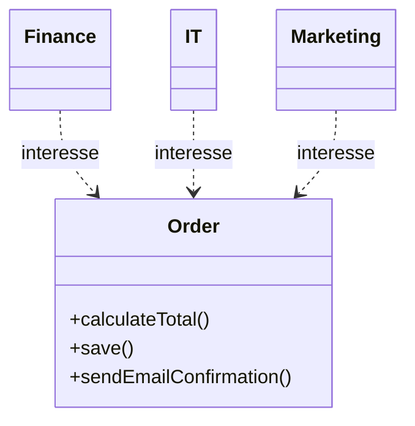
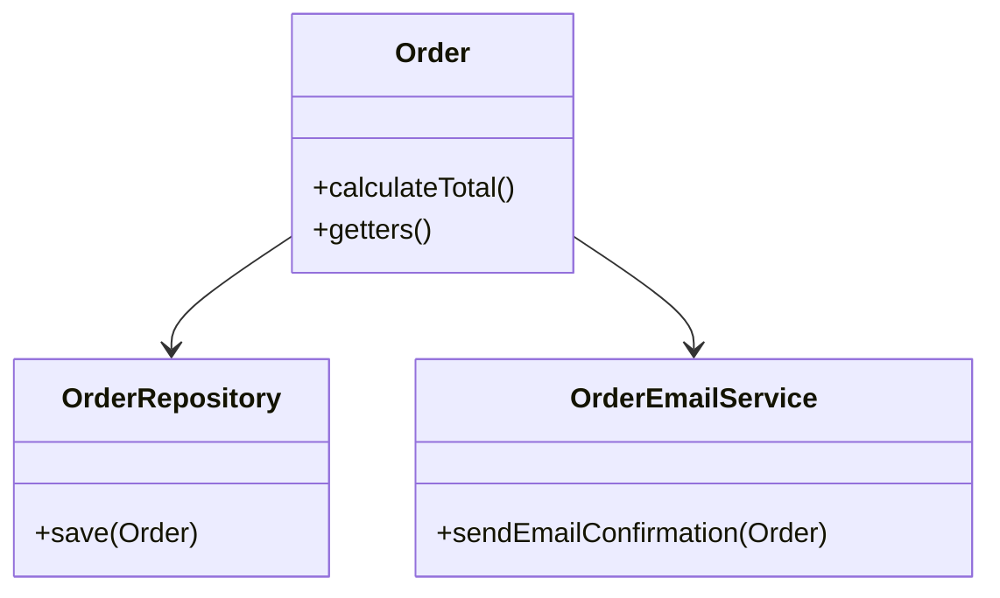
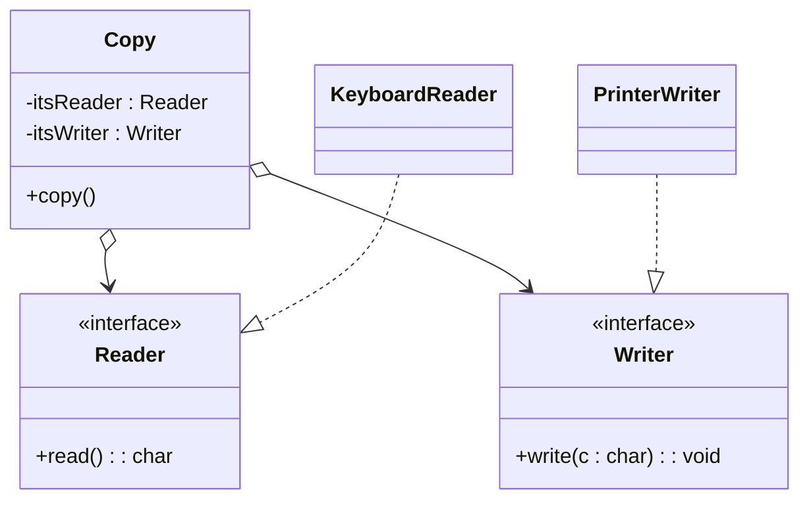
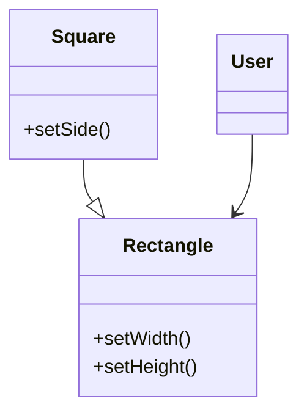
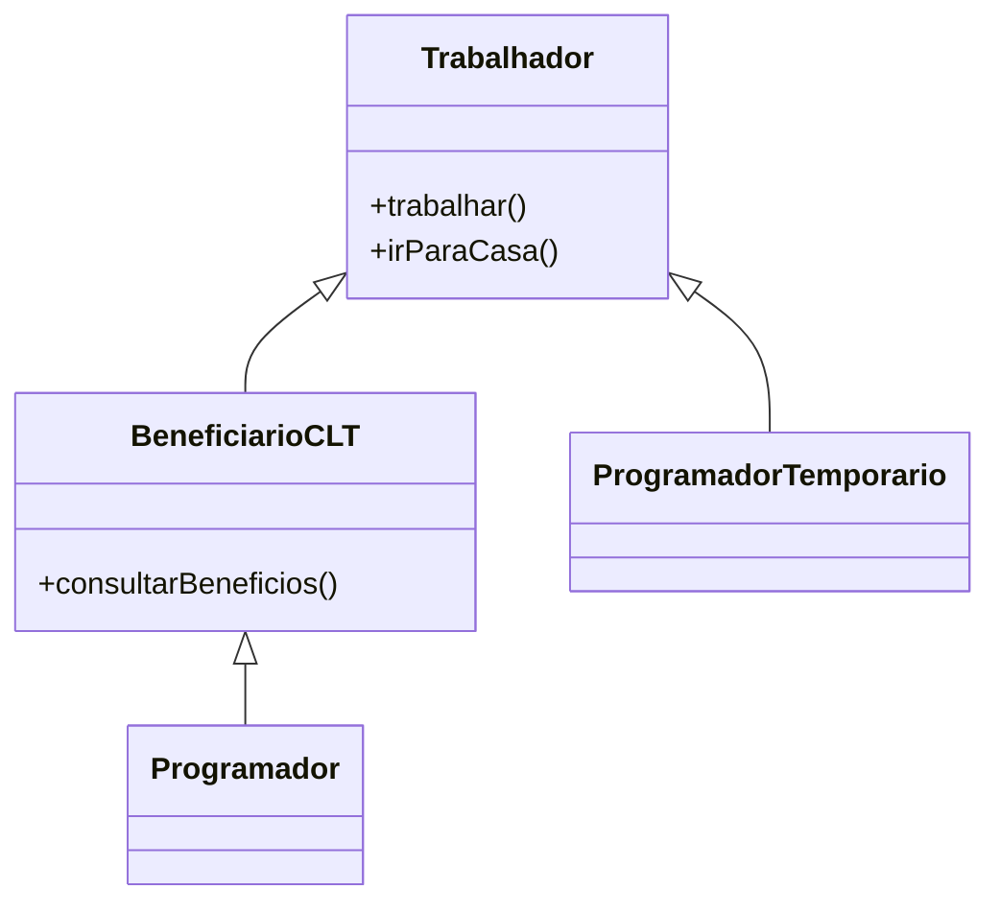
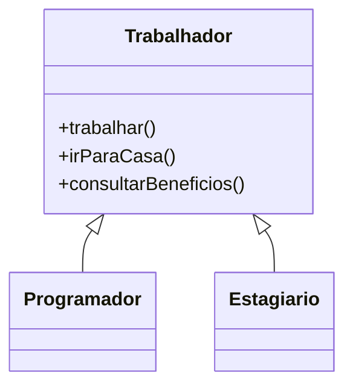
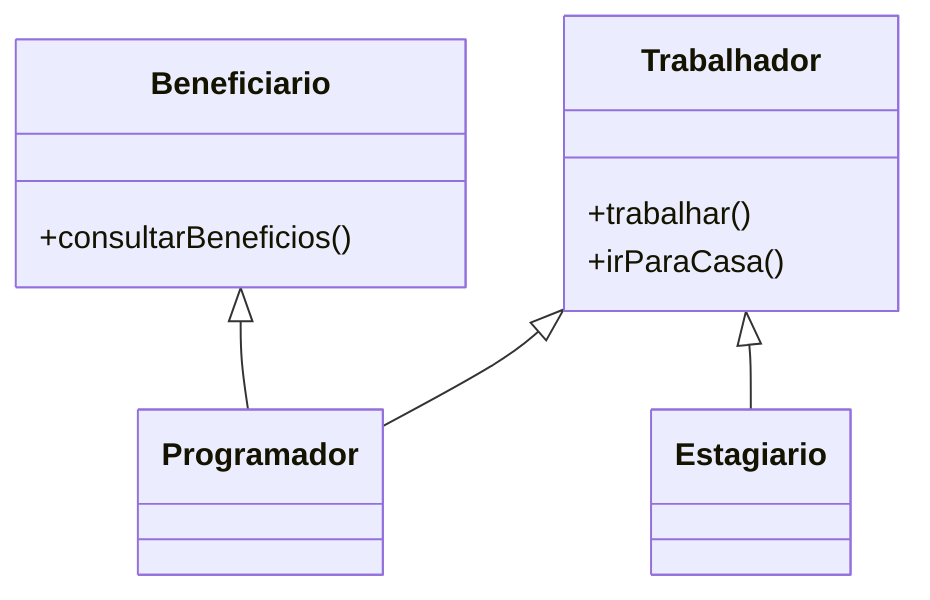
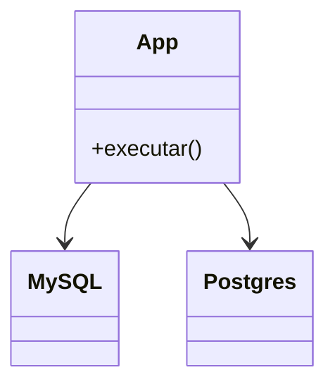
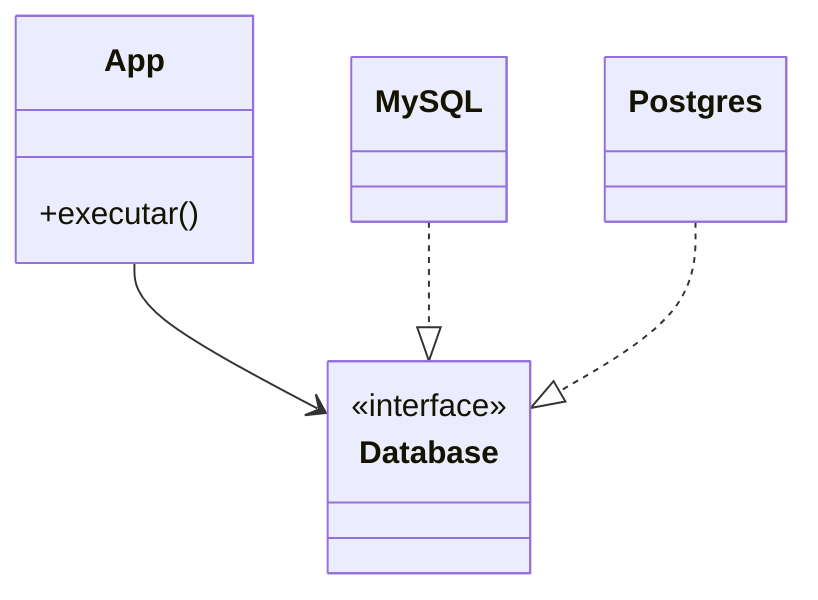

Na Programação Orientada a Objetos, SOLID é um acrônimo que reúne cinco princípios criados para tornar o código mais fácil de compreender, desenvolver e manter. Esses princípios foram consolidados por Uncle Bob, e o acrônimo em si foi proposto por Michael Feathers em 2004.  
Ao longo deste conteúdo, vamos explorar o que cada letra significa, qual problema cada princípio busca resolver e quais cuidados precisamos ter ao aplicá-los no dia a dia.

## **S - Single Responsibility Principle (SRP)**

> Um módulo, classe ou entidade de software deve ter apenas um motivo para mudar.

### **Motivação**

Com o tempo, o código tende a se tornar “sujo”, cheio de responsabilidades misturadas, difícil de manter e de entender.  
Isso acontece porque, naturalmente, o software evolui conforme as necessidades dos usuários.

O SRP surge para isolar as causas de mudança: se cada classe tem um único motivo para ser alterada, as consequências de uma modificação ficam contidas em um lugar só.

Em outras palavras:

> Cada classe deve responder a apenas um ator ou grupo de pessoas interessadas naquela funcionalidade.

### **De onde vem essa ideia**

Uncle Bob (Robert C. Martin) formulou o SRP ao observar que a maioria dos problemas em sistemas grandes vem de misturar interesses diferentes na mesma unidade de código.
Ele explica que o _ator_ é quem “pede” a mudança.  
Se uma classe serve a vários atores (financeiro, TI, auditoria...), ela tem múltiplas razões para mudar e isso é um problema.

### **Exemplo conceitual**

Imagine uma classe `Order` com vários métodos:

- **`calculateTotal()`** → interessa ao Finance (cálculo de valores, impostos, descontos)
- **`save()`** → interessa ao IT (persistência, banco de dados)
- **`sendEmailConfirmation()`** → interessa ao Marketing / Vendas (comunicação com o cliente)

Aqui há três atores diferentes, cada um com um motivo próprio para solicitar mudanças nessa classe. Logo, o `Order` tem múltiplas responsabilidades -> violação direta do SRP.

### **Por que isso é perigoso**

- Uma mudança no cálculo do total pode quebrar o envio do e-mail.
- O desenvolvedor que mexe em `save()` pode impactar sem querer a lógica de cálculo do pedido.
- Testar a classe inteira exige conhecer todos esses contextos diferentes.

**Resultado**: baixo isolamento e alto acoplamento.

### **Como resolver**

Dividindo as responsabilidades por ator, mantendo alta coesão em cada classe:

Agora:

- `Order` cuida apenas de dados do pedido e cálculo do total
- `OrderRepository` trata da persistência
- `OrderEmailService` cuida de notificações/email

Cada uma tem um motivo claro para mudar e responde a um único ator.

### **Relação com outros princípios**

- O SRP facilita o OCP (Open/Closed), porque quando as classes são coesas, é mais fácil estendê-las sem modificá-las.
- Também ajuda o DIP, pois separa responsabilidades e permite que cada uma dependa de abstrações menores.
- Em resumo: SRP é a base para construir sistemas módulos, extensíveis e testáveis.

### **Cheiro de violação do SRP**

| Sinal de alerta                                     | O que significa                                |
| --------------------------------------------------- | ---------------------------------------------- |
| Classe cresce com o tempo (vira “classe deus”)      | Mistura responsabilidades                      |
| Métodos que atendem públicos diferentes             | Mais de um ator interessado                    |
| Mudanças frequentes quebram partes não relacionadas | Falta isolamento                               |
| Métodos privados “de apoio” em excesso              | Tentativa de esconder responsabilidades extras |

**Pergunte-se:**

> “Se eu mudar esse comportamento, quem está pedindo essa alteração?”

Se a resposta envolver mais de um tipo de usuário ou área do sistema, a classe viola o SRP.

### **Resumo**

- O SRP não significa que uma classe só pode ter uma função, mas sim que todas as funções devem servir ao mesmo motivo de mudança.
- Ele ajuda a reduzir o acoplamento, melhorar testabilidade e tornar o sistema mais previsível.
- É o primeiro passo para a manutenção sustentável de software orientado a objetos.

## **O - Open/Closed Principle (Princípio Aberto-Fechado)**

O OCP diz que as entidades de software (classes, módulos, funções) devem estar abertas para extensão, mas fechadas para modificação.

Ou seja, você deve poder adicionar novos comportamentos ao sistema sem alterar o código existente.  
Isso é essencial para garantir estabilidade e evitar que novas funcionalidades quebrem partes antigas.

### **Motivação**

Quando o sistema cresce, o código tende a se tornar frágil.  
Adicionar uma nova regra, e algo que funcionava antes deixa de funcionar.
O OCP surgiu como resposta a esse tipo de fragilidade.

O objetivo é proteger o código consolidado, permitindo que novas regras ou variações sejam adicionadas sem tocar no que já foi testado.

### **De onde vem essa ideia**

Robert C. Martin formulou o OCP inspirado nos trabalhos de Bertrand Meyer, que no livro _Object-Oriented Software Construction_ (1988) escreveu literalmente:

> “Um módulo deve estar aberto para extensão, mas fechado para modificação.”

Essa frase representa um dos principais pilares do design orientado a objetos. Ela nos diz que devemos estender o módulo sem precisar modificar diretamente seu código-fonte.

### **Exemplo conceitual**

Imagine a classe `Copy`:

A classe `Copy` não sabe de onde os dados vêm (`Reader`) nem para onde vão (`Writer`).
Ela depende apenas das abstrações `Reader` e `Writer`.  
Isso significa que, se eu precisar copiar um arquivo, um socket, um filme ou enviar a saída para a tela, basta criar uma nova classe que implemente essas interfaces, sem alterar a classe `Copy`.  
O código original permanece fechado para modificação, mas o sistema está aberto para extensão.

Metáfora: “A Máquina de Copiar Coisas”.

### **Por que isso é importante**

O código fechado protege as funcionalidades já testadas e estáveis.  
Quando uma nova necessidade surge, você adiciona um novo módulo, em vez de alterar um que já existe. Além de ser uma arquitetura sustentável, onde os módulos não precisam ser reescritos cada vez que a regra de de negócio muda.

### **Como aplicar**

Existem várias formas práticas de aplicar o OCP:

1. **Herança** - criar subclasses para adicionar comportamento novo.
2. **Interfaces e abstrações** - depender de contratos, não de implementações.
3. **Composição** - injetar comportamentos novos em tempo de execução.
4. **Inversão de dependência (DIP)** - conectar módulos através de abstrações estáveis.

Hoje, o OCP é quase sempre implementado em conjunto com DIP, porque sem abstrações é impossível estender sem modificar.  
Por isso, o OCP depende da inversão das dependências. As setas do código devem apontar para abstrações, não para detalhes concretos.

### **Cheiro de violação**

|Sinal de alerta|O que indica|
|---|---|
|Muitos `if/else` para tratar variações de tipo|comportamento fixo no código|
|Módulo precisa ser editado sempre que há um novo caso|acoplamento alto|
|Uma mudança em um comportamento quebra outro|violação de encapsulamento|
|Classe conhece muitos detalhes concretos|falta de abstração|

**Pergunte-se:**

> “Consigo adicionar um novo comportamento sem editar código existente?”

Se a resposta for não, o módulo não está fechado para modificação.

### **Relação com outros princípios**

- O OCP depende fortemente do **DIP** (Inversão de Dependência).
- Ele também se apoia no **SRP**: classes coesas e com uma única responsabilidade são mais fáceis de estender sem tocar no código existente.
- O **LSP** (Substituição de Liskov) garante que as extensões realmente se comportem como o tipo base — sem surpresas.

### **Resumo**

O OCP é o princípio que transforma código “duro” em arquitetura flexível.  
Ele permite mudar o comportamento sem mudar o código, adicionando novas implementações ao invés de editar as antigas.

> “Aberto para extensão, fechado para modificação.”  
> É o lema de quem quer evoluir software sem quebrar o que já funciona.

## **L - Liskov Substitution Principle (Princípio da Substituição de Liskov)**

> “Classes derivadas devem ser substituíveis por suas classes base, sem alterar o comportamento esperado do programa.”
> — Barbara Liskov, 1987

### **Motivação**

O polimorfismo é uma das bases da POO, mas ele só funciona de verdade se as classes filhas respeitarem o contrato da classe pai.

O Princípio da Substituição de Liskov (LSP) surge justamente para garantir isso:

> Se uma classe `B` herda de `A`, então o código que usa `A` deve funcionar sem problemas se receber um objeto de `B`.

Em outras palavras, a subclasse deve poder substituir a superclasse sem quebrar expectativas.

### **O exemplo clássico: Quadrado e Retângulo**

No mundo da geometria, é verdade que um quadrado é um retângulo, mas no mundo do código, isso nem sempre funciona.

Um `Rectangle` tem dois atributos independentes: largura e altura.  
Já o `Square` precisa que largura = altura.  
Logo, para manter essa regra, o `Square` teria de sobrescrever os métodos `setWidth()` e `setHeight()` para atualizar ambos e isso quebra a expectativa de quem usa `Rectangle`.

### **Por que isso viola o LSP**

Quem consome um `Rectangle` espera poder mudar só a largura sem afetar a altura.  
Mas se, ao fazer isso, a altura também muda, o comportamento não é mais o mesmo.

Essa diferença surpreende o usuário da classe base, e o contrato foi quebrado.

Barbara Liskov definiu isso com base em três regras fundamentais:

1. **Pré-condições não podem ser fortalecidas.**
	- A subclasse não pode exigir mais do que a classe base exigia.
	- Exemplo: imagine que a classe base aceita qualquer número como entrada. Se a subclasse altera e passa a aceitar valores acima de 10, ela está adicionando uma exigência nova, portanto isso não é permitido.
2. **Pós-condições não podem ser enfraquecidas.**
	- A subclasse não pode garantir menos do que a classe base prometia.
	- Exemplo: imagine que a classe base faz um cálculo e retorna o valor e a porcentagem. Se a subclasse passar a retornar somente o valor, ela está ferindo a regra, pois está oferecendo menos do que deveria cumprir.
3. **Invariantes devem ser preservadas.**
	-  As condições que a superclasse mantém sempre verdadeiras devem continuar verdadeiras na subclasse.
	- Exemplo: seguindo o caso das pós-condições, se a classe base tem como regra que sempre deve retornar o valor e a porcentagem, mas a subclasse retorna apenas o valor, ela quebra essa regra que deveria ser mantida.

Essas regras são o “contrato invisível” entre pai e filho, caso sejam violadas, o polimorfismo deixa de ser confiável.

### **Como detectar violação**

Você provavelmente está quebrando o LSP quando:

- precisa fazer a verificação do tipo do objeto para tratar subclasses diferentes;
- altera o comportamento de métodos herdados de forma que muda o resultado esperado;
- lança exceções que a classe base não previa;
- adiciona restrições que o tipo base não tinha.

**Pergunte-se:**

> “Se eu substituir o tipo base pela subclasse, o programa se comporta exatamente igual?”

Se a resposta for não, o LSP foi violado.

### **Exemplo conceitual prático**

Aqui, `Programador` e `ProgramadorTemporario` são trabalhadores.  
Mas apenas o `Programador` CLT tem direito a `consultarBeneficios()`.

Se `ProgramadorTemporario` herdasse diretamente de `Trabalhador` que contém esse método,
ele seria obrigado a implementá-lo, mesmo que não faça sentido.  
Isso quebraria o contrato: o método existe, mas o comportamento é inválido.

### **Como resolver**

Separe os contratos conforme as capacidades reais de cada tipo.
Use interfaces específicas para papéis distintos:

- `Trabalhador` -> ações básicas de trabalho.
- `BeneficiarioCLT` -> apenas para quem tem benefícios.

Assim, `ProgramadorTemporario` pode implementar só o que faz sentido para ele,
sem violar o contrato da classe base.

### **Relação com outros princípios**

- O LSP é essencial para o **OCP**: se as subclasses não puderem substituir a base com segurança, não há como estender sem quebrar.
- Ele também se conecta ao **ISP**, porque interfaces bem definidas evitam forçar comportamentos errados.
- E ele reforça o **DIP**, já que o alto nível só deve depender de abstrações estáveis, respeitando contratos.

### **Cheiro de violação**

|Sinal de alerta|Indica o quê|
|---|---|
|`if isinstance` ou `switch(type)`|Polimorfismo incorreto|
|Subclasse lança exceções inesperadas|Contrato quebrado|
|Subclasse ignora regras da base|Violação de invariantes|
|Métodos “vazios” ou `NotImplementedError`|Interface mal aplicada|

> Se você precisa verificar o tipo real de um objeto para decidir o que fazer,
> é sinal de que a herança foi mal projetada.

Quando o design está certo, o polimorfismo faz o trabalho sozinho.

### **Resumo**

- LSP garante que a herança preserve o comportamento esperado.
- O sistema só é verdadeiramente orientado a objetos quando as subclasses são previsíveis.
- O foco não é herdar código, mas preservar comportamento.
- Prefira interfaces coesas e composição sempre que o comportamento variar muito.

## **I - Interface Segregation Principle (Princípio da Segregação de Interface)**

> “Nenhuma classe deve ser forçada a depender de métodos que não utiliza.”  
> — Robert C. Martin

### **Motivação**

Com o tempo, sistemas orientados a objetos tendem a ganhar interfaces cada vez maiores, tentando ser genéricas o suficiente para atender vários casos.  
Mas isso acaba criando contratos gordos, cheios de métodos que algumas classes não precisam implementar.

O ISP existe para evitar esse tipo de acoplamento desnecessário.

Em outras palavras:

> Cada cliente deve depender apenas dos métodos que realmente usa.

### **De onde vem a ideia**

Esse princípio nasceu da observação de que, em sistemas grandes, quando uma interface muda, todas as classes que a implementam precisam mudar também.  
Se essas classes implementam métodos que não usam, qualquer modificação em um método inútil ainda obriga recompilar e retestar tudo.

O ISP foi inspirado diretamente pelo SRP (Single Responsibility):
se uma classe deve ter apenas um motivo para mudar, uma interface também deve ter apenas um motivo para ser alterada.

### **Exemplo conceitual**

Aqui, `Estagiario` é forçado a implementar o método `consultarBeneficios()`,
mesmo que ele não tenha benefícios.  
Isso gera um método inútil, ou pior, um método que lança exceção. Uma violação clara do ISP.

### **Como resolver**

A solução é quebrar a interface em partes menores e específicas.

Agora:

- `Trabalhador` define as ações comuns a todos.
- `Beneficiario` define o que é específico a quem tem benefícios.
- `Estagiario` não precisa depender de nada que não usa.

Resultado: baixo acoplamento e alta coesão.

### **Cheiro de violação**

| Sinal de alerta                                                              | O que indica               |
| ---------------------------------------------------------------------------- | -------------------------- |
| Interface com muitos métodos “opcionais”                                     | Contrato genérico demais   |
| Classes com métodos vazios ou que lançam exceções de erro.                   | Dependência forçada        |
| Mudanças em uma interface afetam muitas classes                              | Alta instabilidade         |
| Interfaces nomeadas como “InterfaceService”, “InterfaceManager” sem contexto | Design genérico e acoplado |

**Pergunte-se:**

> “Se eu alterar essa interface, quantas classes precisam mudar junto?”

Se a resposta for “muitas”, a interface está mal segregada.  
Interfaces boas devem impactar apenas as classes que realmente usam seus métodos.

### **Relação com outros princípios**

- O **ISP** é quase uma aplicação do **SRP** ao nível das interfaces.
- Ele **reforça o LSP**, porque evita que subclasses herdem contratos irrelevantes.
- E facilita o **DIP**, já que abstrações pequenas e específicas são mais fáceis de substituir e injetar.

Esse trio (SRP + ISP + DIP) forma a base da modularidade moderna:
cada módulo depende apenas do que precisa, e nada mais.

### **Por que isso importa**

Interfaces inchadas criam dependências desnecessárias e tornam o sistema frágil.
Cada cliente passa a depender de coisas que não controla, e toda alteração em uma interface “genérica” exige testes em dezenas de lugares.

Em arquitetura limpa e DDD, o ISP é aplicado para manter os limites de contexto:
cada bounded context tem suas próprias interfaces específicas, que refletem apenas as operações relevantes àquele domínio.

### **Resumo**

- O ISP busca interfaces pequenas, coesas e estáveis.
- Cada cliente deve ter seu próprio contrato, e não herdar métodos que não precisa.
- É melhor ter várias interfaces específicas do que uma interface genérica e inchada.

## **D - Dependency Inversion Principle (Princípio da Inversão de Dependência)**

> “Módulos de alto nível não devem depender de módulos de baixo nível.
> Ambos devem depender de abstrações.”
> — Robert C. Martin

### **Motivação**

Quando escrevemos código, é comum que módulos de alto nível (como a lógica de negócio) dependam diretamente de detalhes técnicos de baixo nível (como banco de dados, APIs ou arquivos). Isso torna o sistema frágil e difícil de evoluir.

O DIP existe para reverter essa direção da dependência.  
Em vez de o domínio depender de detalhes técnicos, os detalhes passam a depender do domínio.

### **De onde vem a ideia**

O DIP nasceu da observação de que a maioria dos sistemas colapsa porque a camada de negócio é dependente de detalhes voláteis como  frameworks, drivers, banco, etc.

Em vez de o código de negócio depender das ferramentas, as ferramentas passam a depender das regras de negócio.  
Podemos observar o diagrama abaixo:

>Martin, Robert C — Dependency Structure of an Object Oriented Architecture — Design Principles and Design Patterns

Isso cria um sistema mais estável, porque as regras (que mudam menos) ficam isoladas dos detalhes (que mudam o tempo todo).

### **O problema (sem DIP)**

Aqui, o módulo `App` cria instâncias de `MySQL` ou `Postgres` diretamente.  
Se amanhã quisermos trocar o banco, teremos que alterar a própria aplicação, ou seja, o alto nível depende do baixo nível.

Isso viola o OCP (pois é preciso modificar código existente) e quebra a flexibilidade.

### **A solução (com DIP)**

Agora `App` depende da abstração `Database`, e não das implementações concretas.
Qualquer banco que implemente essa interface pode ser usado sem alterar a aplicação.

Perceba que as dependências se inverteram:

- Antes: o alto nível (App) dependia do baixo nível (MySQL).
- Depois: o baixo nível (MySQL) depende do alto nível (a abstração `Database` definida pelo domínio).

> Essa inversão é o coração do DIP.

### **Por que isso é importante**

- **Flexibilidade:** podemos mudar implementações sem mexer nas regras de negócio.
- **Testabilidade:** podemos injetar mocks ou fakes nos testes.
- **Baixo acoplamento:** módulos se comunicam por contratos, não por detalhes.
- **Arquitetura limpa:** o fluxo de dependências sempre aponta para dentro (domínio).

### **Diferença entre DIP e DI**

> Eles se relacionam, mas **não são a mesma coisa**.

| Termo                         | Significado                                                                  | Tipo     |
| ----------------------------- | ---------------------------------------------------------------------------- | -------- |
| **DIP**                       | Princípio de design — define que dependências devem apontar para abstrações. | Conceito |
| **DI (Dependency Injection)** | Mecanismo — é a forma prática de fornecer a abstração ao código.             | Técnica  |

### **Como aplicar o DIP**

1. **Identifique as dependências instáveis.**
    (bancos, APIs externas, loggers, frameworks).
2. **Crie abstrações** que descrevem o contrato do que essas dependências fazem.
    (ex.: `Database`, `MessageSender`, `StorageProvider`)
3. **Faça o módulo de alto nível depender da abstração.**
    (injeção via construtor, preferencialmente)
4. **Faça os módulos concretos implementarem a abstração.**
5. **Inverta a direção da dependência:**  agora os detalhes passam a depender das regras de negócio, e não o contrário

### **Cheiro de violação**

| Sinal de alerta                                | Indica o quê                      |
| ---------------------------------------------- | --------------------------------- |
| Classe cria dependências com `new`             | Alto nível acoplado a baixo nível |
| Alterar o banco obriga mudar código de negócio | Falta abstração                   |
| Testes difíceis por dependência concreta       | Falta inversão                    |
| Domínio importa frameworks externos            | Mistura de camadas                |

**Pergunte-se:**

> “Se eu trocar a implementação dessa dependência, o módulo principal continua funcionando igual?”

Se a resposta for sim, o DIP está sendo respeitado.
Se não, ainda há acoplamento a detalhes.

### **Relação com outros princípios**

- O DIP **sustenta o OCP**, porque abstrações permitem estender sem modificar.
- Ele **depende do SRP**: cada módulo deve ter uma responsabilidade clara.
- Ele **facilita o ISP**, porque interfaces pequenas e específicas são mais fáceis de injetar.
- E ele **fecha o ciclo** do SOLID: é o princípio que une todos os outros na prática.

O DIP também é o núcleo da Clean Architecture, é o princípio que define a famosa “linha vermelha” entre o domínio (estável) e a infraestrutura (instável).  
Acima da linha: regras de negócio, políticas e abstrações.  
Abaixo: detalhes técnicos que implementam essas abstrações.

### **Resumo**

- Módulos de alto nível devem depender apenas de abstrações, nunca de detalhes.
- A inversão das dependências protege o domínio e aumenta a testabilidade.
- É o elo final que mantém o sistema flexível, extensível e sustentável.

> “Dependa de abstrações, não de implementações.”

## **Como eles se conectam**

Esses princípios se reforçam mutuamente:

| Relação        | Significado                                                             |
| -------------- | ----------------------------------------------------------------------- |
| SRP -> OCP     | Classes coesas são mais fáceis de estender.                             |
| LSP -> OCP/DIP | Polimorfismo confiável permite extensão segura.                         |
| ISP -> DIP     | Interfaces pequenas e específicas simplificam injeção.                  |
| DIP -> Todos   | A inversão das dependências é o pilar que sustenta a arquitetura limpa. |

Quando aplicados em conjunto, criam um ciclo virtuoso:  
baixo acoplamento -> alta coesão -> alta testabilidade -> manutenção previsível.

## **Erros comuns ao aplicar SOLID**

| Erro                                                | O que causa                                            |
| --------------------------------------------------- | ------------------------------------------------------ |
| Aplicar SRP pensando apenas em “funções por classe” | O foco é o ator, não a função.                         |
| Forçar herança no lugar de composição               | Quebra o LSP e aumenta o acoplamento.                  |
| Criar interfaces genéricas demais                   | Viola ISP e gera dependência cruzada.                  |
| Depender de frameworks no domínio                   | Viola DIP — o domínio nunca depende da infraestrutura. |

Esses erros são normais no começo.
O mais importante é entender o motivo por trás de cada princípio, e não apenas segui-los mecanicamente.

## **Conclusão - Amarrando os princípios do SOLID**

O SOLID não é um conjunto de “regrinhas” isoladas.  
É um modo de pensar o design orientado a objetos, criado para que o código possa mudar sem se quebrar. Dito isso, transforma sistemas frágeis em sistemas modulares, onde cada parte conhece apenas o que precisa e nada mais.  
Esse é o ponto central que diferencia "um código que funciona" de um código que evolui.

Quando aplicados juntos, esses cinco princípios formam uma estrutura sólida:

- **S (SRP)** — cada módulo tem apenas uma razão para mudar.
- **O (OCP)** — o código pode ser estendido sem ser modificado.
- **L (LSP)** — as subclasses preservam o comportamento esperado.
- **I (ISP)** — cada interface é coesa e específica para seu cliente.
- **D (DIP)** — as dependências apontam para abstrações, não para detalhes.

# Referências

- https://medium.com/swift-india/solid-principles-part-3-liskov-substitution-principle-723e025d0589
- https://web.archive.org/web/20191116231621/https://fi.ort.edu.uy/innovaportal/file/2032/1/design_principles.pdf
- https://www.youtube.com/watch?v=xNgXAQjICpQ
- https://blog.cleancoder.com/uncle-bob/2020/10/18/Solid-Relevance.html
- https://medium.com/backticks-tildes/the-s-o-l-i-d-principles-in-pictures-b34ce2f1e898
- https://www.youtube.com/playlist?list=PLAgbpJQADBGK8EemmTEoIwW08bXCjfSuA
- https://www.freecodecamp.org/portuguese/news/os-principios-solid-da-programacao-orientada-a-objetos-explicados-em-bom-portugues/
- https://medium.com/desenvolvendo-com-paixao/o-que-%C3%A9-solid-o-guia-completo-para-voc%C3%AA-entender-os-5-princ%C3%ADpios-da-poo-2b937b3fc530
- http://butunclebob.com/ArticleS.UncleBob.PrinciplesOfOod